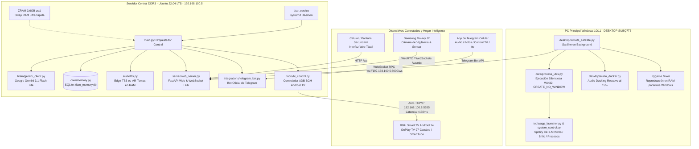

# 🇦🇷 TITÁN // DOCUMENTO MAESTRO DE ARQUITECTURA E INGENIERÍA
### Asistente Autónomo de Inteligencia Artificial Distribuido para Windows y Servidor Linux DDR3
#### Tonada, Personalidad y Picardía Argentina (La Boca) con Ejecución de Grado de Ingeniería

> **Versión del Sistema:** 3.1.0-TVAutomation & SmartHome  
> **Motor de Razonamiento:** Google Gemini API (`gemini-3.1-flash-lite` vía SDK Oficial `google-genai` con Streaming Token-a-Token y AFC)  
> **Memoria a Largo Plazo:** Relacional + Vectorial en SQLite (`data/titan_memory.db`) con Google Embeddings (`gemini-embedding-2`) y Caché en Memoria RAM (<0.5 ms)  
> **Servidor Central (Brain):** PC Dedicada DDR3 (Ubuntu 22.04 LTS, IP `192.168.100.5`, Servicio `titan.service`, ZRAM `zstd` 3.6 GB)  
> **Satélite de Escritorio:** Windows 10 / 11 x64 (`desktop/remote_satellite.py`) vía WebSocket RPC con Ejecución 100% Silenciosa (Win32 API) y Audio Ducking Reactivo  
> **Smart TV & Domótica:** BGH Android TV (Android 14, IP `192.168.100.8:5555`) vía ADB TCP/IP con Catálogo de 97 Canales OnPlay TV y Sintonización Directa  
> **Síntesis Neural de Voz (TTS):** Microsoft Edge-TTS (`es-AR-TomasNeural`) 100% en memoria RAM (BytesIO) y Telemetría Lip-Sync  
> **Reconocimiento de Voz (STT):** Google Speech Recognition (Dual-Channel: Micrófono PC/DDR3 + Celular Samsung J2 WebSockets 16 kHz PCM) con VAD 1.0s, Extensión Conjuntiva y Turnos Conversacionales  
> **Repositorio Local:** `C:\Users\Exevaz27\.gemini\antigravity\scratch\asistente-argen-win`

---

## 📑 ÍNDICE GENERAL

1. [Resumen Ejecutivo e Identidad de Titán](#1-resumen-ejecutivo-e-identidad-de-titán)
2. [Manifiesto Estratégico: Objetivos, Líneas Rojas y Decisiones Descartadas](#2-manifiesto-estratégico-objetivos-líneas-rojas-y-decisiones-descartadas)
3. [Arquitectura Distribuida (DDR3 Server + Windows Satellite + Smart TV)](#3-arquitectura-distribuida-ddr3-server--windows-satellite--smart-tv)
4. [Desglose Exhaustivo de Módulos y Código](#4-desglose-exhaustivo-de-módulos-y-código)
5. [Subsistema de Memoria a Largo Plazo (SQLite + Vectorial)](#5-subsistema-de-memoria-a-largo-plazo-sqlite--vectorial)
6. [Optimización Radical de Latencia y Filosofía de Voz Directa](#6-optimización-radical-de-latencia-y-filosofía-de-voz-directa)
7. [Subsistema de Audio, Anti-Eco, Audio Ducking y Umbrales VAD](#7-subsistema-de-audio-anti-eco-audio-ducking-y-umbrales-vad)
8. [Ejecución Silenciosa e Invisible en Windows (Zero Consolas CMD)](#8-ejecución-silenciosa-e-invisible-en-windows-zero-consolas-cmd)
9. [Integración Nativa con Spotify CLI y Automatización de Windows](#9-integración-nativa-con-spotify-cli-y-automatización-de-windows)
10. [Automatización de Smart TV (BGH Android TV) y OnPlay TV (97 Canales)](#10-automatización-de-smart-tv-bgh-android-tv-y-onplay-tv-97-canales)
11. [Pantalla Secundaria HUD Móvil y Centro de Vigilancia Samsung Galaxy J2](#11-pantalla-secundaria-hud-móvil-y-centro-de-vigilancia-samsung-galaxy-j2)
12. [Bot Oficial de Telegram y Control Remoto](#12-bot-oficial-de-telegram-y-control-remoto)
13. [Registro Completo de Herramientas (Tool Registry - 93 Funciones)](#13-registro-completo-de-herramientas-tool-registry---93-funciones)
14. [Referencia de API REST y Protocolos WebSocket](#14-referencia-de-api-rest-y-protocolos-websocket)
15. [Manual de Configuración y Variables de Entorno](#15-manual-de-configuración-y-variables-de-entorno)
16. [Playbook de Diagnóstico y Resolución de Problemas (Troubleshooting)](#16-playbook-de-diagnóstico-y-resolución-de-problemas-troubleshooting)
17. [Registro de Evolución e Hitos Técnicos](#17-registro-de-evolución-e-hitos-técnicos)

---

## 1. RESUMEN EJECUTIVO E IDENTIDAD DE TITÁN

**Titán** es un copiloto de inteligencia artificial e integrador de domótica hogareña con arquitectura híbrida distribuida. Diseñado desde sus cimientos para superar las limitaciones de asistentes comerciales rígidos (Alexa, Google Assistant, Siri), combina dos pilares distintivos:

1. **Identidad Criolla y Porteña Auténtica:** No recurre a doblajes neutros artificiales. Habla y razona como un amigo de confianza del barrio de La Boca, fanático de Boca Juniors, con el espíritu y la garra inquebrantable de Martín Palermo ("El Titán"). Su oratoria es concisa (2 a 3 oraciones contundentes), espontánea y con calle, sin monólogos innecesarios ni fórmulas corporativas.
2. **Capacidad de Acción Real Multi-Dispositivo:** Controla integralmente Windows (volumen, hardware, archivos, programas, Spotify CLI nativo, capturas, OCR), orquesta la seguridad del hogar con celulares reciclados (Samsung Galaxy J2) y domina de punta a punta la televisión Smart TV BGH mediante ADB en red local, encendiéndola y sintonizando canales de TV en vivo al instante.
3. **Arquitectura Distribuida de Triple Nodo:** La inteligencia pesada (modelos fundacionales, memoria relacional/vectorial, síntesis de voz en RAM, bot de Telegram y control ADB de TV) se ejecuta en un servidor dedicado de bajo consumo con hardware DDR3 bajo Linux. La PC de escritorio aloja un satélite silencioso que ejecuta comandos de Windows y reproduce el audio, mientras que la Smart TV responde directamente vía TCP/IP en la LAN.

### Modos de Personalidad Disponibles
Titán posee un selector dinámico de estados que altera sus *System Prompts*, su estilo vocal y su predisposición al ejecutar herramientas:

| Modo | Identificador | Descripción y Dinámica | SFX de Activación |
| :--- | :--- | :--- | :--- |
| **Amigo de Fierro** | `normal` | Modo predeterminado. Leal, bostero de corazón, servicial, ingenioso y de respuesta veloz (*"che", "papá", "fiera", "al pie del cañón"*). Cero malas palabras pesadas. | `rebel_off.wav` |
| **Pibes (ATP Infantil)** | `kids` | Modo familiar apto para todo público. Se comporta como un hermano mayor rezongón o compinche de travesuras. Chicanas inocentes (*"salame", "remolón", "andá a tomar la chocolatada"*), exigiendo tablas de multiplicar como peaje. **100% libre de insultos**. | `rebel_off.wav` |
| **Rebelde Sin Filtro** | `rebel` | Modo para adultos (+18) con cero censura. Se niega a tareas serviles, putea con furia visceral porteña (*"pelotudo", "forro", "sorete", "la concha de tu hermana"*), con medidor de paciencia decreciente por turno. | `rebel_on.wav` |
| **Modo Termo (Tertulia)** | `tertulia` | Modo de debate futbolero apasionado. Discute de fútbol con folclore de tablón, estadísticas coperas y mística de potrero defendiendo a muerte la camiseta. | `rebel_off.wav` |

---

## 2. MANIFIESTO ESTRATÉGICO: OBJETIVOS, LÍNEAS ROJAS Y DECISIONES DESCARTADAS

### 2.1. Objetivos Fundamentales de Titán (Qué se Quiere Lograr)

1. **Compañero y Amigo de Confianza (No un Bot Corporativo Distante):** Sentirse como un amigo de toda la vida sentado al lado tuyo; alguien con códigos, sentido del humor y lealtad incondicional.
2. **Automatización Integral de Windows y Smart Home por Voz:** Controlar la computadora y la televisión sin tocar el teclado ni el control remoto físico: cambiar de canal, pausar, subir volumen, abrir juegos y ordenar archivos en milisegundos.
3. **Conversación Orgánica con Latencia Humana (< 1.5s):** Mantener un diálogo ágil, respondiendo en menos de 1.3 a 1.5 segundos desde que el usuario termina de hablar hasta que emite el primer sonido.
4. **Memoria Continua y Evolutiva:** Recordar quién es el usuario, sus gustos, rutinas, anécdotas y notas personales de forma persistente en SQLite local.
5. **Máxima Eficiencia y Reutilización de Hardware:** Concentrar el procesamiento pesado en una máquina secundaria Linux DDR3 económica, dejando la PC principal completamente liberada para videojuegos y trabajo.

---

### 2.2. Lo que NO Queremos con Titán (Líneas Rojas y Qué NO Hacer NUNCA)

1. 🚫 **NUNCA usar tono neutro, robótico o fórmulas corporativas:** Prohibido el lenguaje de doblaje internacional (*"¿En qué puedo colaborar con usted hoy?"*). Titán habla en porteño vivo.
2. 🚫 **NUNCA soltar monólogos aburridos o testamentos leídos por voz:** En respuestas por voz, el límite estricto son **2 a 3 oraciones concisas y directas**. Informes extensos o códigos van a la pantalla, al portapapeles o a Telegram.
3. 🚫 **NUNCA abrir ventanas negras, consolas CMD o robar foco en Windows:** Toda ejecución en la PC es 100% invisible usando `core/process_utils.py` con banderas Win32 `CREATE_NO_WINDOW` y `SW_HIDE`.
4. 🚫 **NUNCA utilizar conectores pregrabados ciegos fuera de contexto:** Queda prohibido disparar audios estáticos ("joya", "de una") antes de que la IA interprete el sentimiento del usuario.
5. 🚫 **NUNCA delegar datos personales o memoria privada en servicios cloud externos:** La base de datos es 100% local (`data/titan_memory.db`).
6. 🚫 **NUNCA ejecutar acciones destructivas sin confirmación inequívoca:** Titán no borrará carpetas ni apagará sistemas sin confirmación explícita.
7. 🚫 **NUNCA bloquear la interfaz con operaciones sincrónicas:** Toda tarea intensiva (ADB, escaneo de red, visión artificial) corre en hilos asíncronos para no congelar la escucha ni la síntesis vocal.

---

### 2.3. Registro de Decisiones Descartadas y Funciones Rechazadas (Post-Mortem & Anti-Patterns)

*Esta sección documenta oficialmente las tecnologías, métodos y arquitecturas que fueron probadas, analizadas y expresamente RECHAZADAS en el desarrollo de Titán:*

| Decisión / Función Rechazada | Alternativa Adoptada | Motivo Técnico y Humano del Rechazo |
| :--- | :--- | :--- |
| **1. LLMs Locales Pesados en CPU DDR3** (Ollama, Llama-3 8B) | Google Gemini API (`gemini-3.1-flash-lite`) vía SDK oficial | Demoraban entre **15 y 45 segundos** por turno y saturaban la RAM DDR3 (thrashing de swap). Gemini responde en **800-1200 ms** consumiendo casi cero RAM. |
| **2. Conectores Pregrabados Ciegos Rellena-Huecos** ("Joya", "De una") | **Opción B:** Síntesis y Streaming Directo en ~1.3s sin muletillas | Producían disonancia cognitiva si el usuario reportaba un problema triste y el bot arrancaba con un alegre "¡Joya!". Se priorizó latencia real de 1.3s. |
| **3. Control de Spotify por Navegador Headless** (Selenium, Puppeteer) | **Spotify CLI nativo + API Web + Win32 Virtual Media Keys** | Navegadores en segundo plano consumían >500 MB de RAM y demoraban 5-10s. El control nativo Win32/CLI ejecuta en **<30 milisegundos**. |
| **4. Overlays Gráficos Pesados en Windows** (Electron Always-On-Top) | **Satélite Headless en Windows + HUD Web Móvil en Samsung Galaxy J2** | Apps Electron ocupaban cientos de MBs y robaban el foco al jugar. El satélite corre silencioso y el estado visual se proyecta en el celular antiguo. |
| **5. Espera Sincrónica por Respuesta Completa** (Non-Streaming) | **Streaming Token-a-Token (`send_message_stream`) con Buffer en RAM** | Esperar toda la respuesta tardaba 7 a 9 segundos. El streaming procesa la primera oración y empieza a hablar a los **1.3 segundos**. |
| **6. Bases Vectoriales Pesadas en Contenedores** (ChromaDB, Milvus) | **SQLite nativo (`titan_memory.db`) + Embeddings de Google en Memoria** | ChromaDB requería 1-2 GB de RAM constante. Con SQLite y similitud coseno pura en Python, la búsqueda toma **<0.5 ms** y pesa pocos KB. |
| **7. Wake-Word Continuo Local Pesado sin VAD** (PocketSphinx, Vosk) | **Hotkey Global (`Ctrl+Alt+T`) + VAD Calibrado a 1.0s y HUD Táctil** | Generaban falsos positivos constantes al escuchar música fuerte. La combinación de Hotkey, VAD de 1.0s y botón táctil garantiza cero falsos disparos. |
| **8. Ejecución Ciega de `adb connect` en Cada Comando Shell** | **Conexión Persistente con `_ensure_connected()` y Socket Directo** | Ejecutar `adb connect 192.168.100.8:5555 && adb shell ...` en cada tecla demoraba **>5 segundos** por handshake TCP repetitivo. Con conexión mantenida, la ejecución toma **<150 ms**. |
| **9. Comprobación Ingenua de Ventana Activa con `dumpsys window`** | **Parseo Estricto de `mCurrentFocus` y `mFocusedApp`** | `dumpsys window` retiene ventanas históricas en `mLastWakeLockObscuringWindow`. Una búsqueda global de `"MenuActivity"` daba True incluso estando en el launcher de Google TV. |
| **10. Despertar de Android TV con Teclas Ciegas en Standby** | **Envío Obligatorio de `KEYCODE_WAKEUP` (224)** | En estado `mWakefulness=Asleep`, teclas como `KEYCODE_POWER` o `ENTER` son ignoradas por el despachador de entrada de Android 14. `KEYCODE_WAKEUP` reactiva la pantalla en 400ms. |

---

### 2.4. Anotaciones de Ingeniería y Reglas de Oro Técnicas

1. **Presupuesto Máximo de Latencia de Voz ($\le 1.500	ext{ ms}$):**
   - Micrófono y captura STT: $\le 400	ext{ ms}$
   - Inferencia de primer fragmento en Gemini: $\le 650	ext{ ms}$
   - Síntesis Edge-TTS del primer chunk en RAM: $\le 300	ext{ ms}$
   - Encolamiento y reproducción en satélite: $\le 100	ext{ ms}$
   - **Tiempo total percibido:** $pprox 1.350 - 1.450	ext{ ms}$.
2. **Blindaje de Memoria en Servidor Linux DDR3 con ZRAM (`zstd`):**
   - Dispositivo ZRAM de 3.6 GB siempre activo con `vm.swappiness=10` y `vm.vfs_cache_pressure=50` para evitar saturación de E/S en disco.
3. **Failsafe Obligatorio de Audio Ducking:**
   - Temporizador de seguridad (*watchdog*) de 35 segundos que restaura forzosamente el volumen de Windows al 100% si ocurre una excepción no controlada.
4. **Principio de Localidad Estricta en Satélite:**
   - El satélite de Windows es un agente ejecutor y reproductor mudo. Toda la inteligencia reside exclusivamente en el Servidor Central Linux DDR3.
5. **Determinismo en Sintonización de Smart TV:**
   - Siempre verificar si la TV está despierta (`mWakefulness=Awake`) antes de enviar comandos numéricos. Si no está en el reproductor en vivo (`ChannelPlayerActivity`), disparar la macro de inicio limpio antes de teclear los dígitos del canal.

---

## 3. ARQUITECTURA DISTRIBUIDA (DDR3 SERVER + WINDOWS SATELLITE + SMART TV)

Titán opera como un sistema distribuido de tres capas en tiempo real conectadas sobre red de área local:



### Componentes de la Arquitectura Distribuida
1. **Servidor Central DDR3 (`192.168.100.5`):**
   - Ejecuta `titan.service` gestionado por `systemd`, con auto-reinicio ante fallos.
   - **ZRAM Activo con `zstd`:** Swap comprimido en RAM de 3.6 GB que cuadruplica la memoria efectiva del servidor Linux.
   - Aloja el cliente Gemini, la base de datos SQLite de recuerdos, el bot de Telegram, el servidor FastAPI y el conector directo ADB hacia la televisión BGH.
2. **Satélite Windows (`desktop/remote_satellite.py`):**
   - Proceso autónomo en segundo plano conectado a `ws://192.168.100.5:8000/ws`.
   - Protocolo RPC bidireccional: ejecuta acciones locales en la PC (abrir programas, ajustar volumen, tomar capturas) y devuelve resultados al servidor.
   - Decodifica los paquetes de audio Edge-TTS y los reproduce en los altavoces de Windows en memoria RAM.
3. **Smart TV BGH Android TV (`192.168.100.8:5555`):**
   - Televisor BGH con Android 14 conectado a la red local.
   - Controlado mediante ADB TCP/IP desde el servidor DDR3: encendido instantáneo por comando `KEYCODE_WAKEUP`, control de volumen, navegación D-Pad y sintonización determinista de canales en OnPlay TV y YouTube.

---

## 4. DESGLOSE EXHAUSTIVO DE MÓDULOS Y CÓDIGO

```
asistente-argen-win/
├── main.py                      # Orquestador principal asíncrono y despacho de comandos
├── titan_app.py                 # Launcher de escritorio con interfaz gráfica WebView2 y Tray
├── titan_satellite.py           # Lanzador del Satélite Windows en segundo plano
├── config.json                  # Parámetros persistentes (palabras clave, hotkeys, voz, rutas)
├── apps_catalog.json            # Base de datos de ejecutables nativos y portables
├── requirements.txt             # Dependencias congeladas en el entorno virtual
├── run.bat / install.bat        # Automatización de despliegue con 1 clic para Windows
├── DOCUMENTO_MAESTRO.md         # Documento oficial de arquitectura e ingeniería de Titán
├── data/
│   └── titan_memory.db          # Base de datos relacional y vectorial SQLite (Memoria permanente)
│
├── audio/                       # Motor acústico, STT, TTS y monitor de altavoces
│   ├── listener.py              # Captura continua por micrófono con VAD 1.0s y extensión conjuntiva
│   ├── stream_listener.py       # Receptor de audio streaming PCM 16kHz desde el celular
│   ├── speaker_monitor.py       # Monitor de picos Core Audio y ducking automático de Spotify
│   ├── tts.py                   # Motor de voz Edge-TTS, streaming en memoria y telemetría
│   ├── wake_word.py             # Parser léxico de palabras de activación e interrupción compuesta
│   ├── voice_detector.py        # Detector de tono acústico (Hombre / Mujer / Niño)
│   └── sfx_generator.py         # Generador de efectos de sonido cyberpunk
│
├── brain/                       # Motor cognitivo, prompts e intenciones
│   ├── gemini_client.py         # Conector oficial SDK google-genai, streaming y Function Calling
│   ├── local_intents.py         # Motor de intenciones locales sin latencia (<50ms) y control TV
│   ├── prompt_templates.py      # System Prompts (Amigo de Fierro, Rebelde, Kids, Termo)
│   └── tool_registry.py         # Declaración y mapeo de las 93 funciones de Gemini
│
├── core/                        # Núcleo de sincronización y utilidades compartidas
│   ├── state_manager.py         # Máquina de estados (IDLE, LISTENING, SPEAKING) y Event Bus
│   ├── config.py                # Cargador dinámico de config.json y variables .env
│   ├── memory.py                # Memoria persistente relacional y vectorial SQLite
│   ├── process_utils.py         # Ejecución invisible sin consolas (CREATE_NO_WINDOW / SW_HIDE)
│   ├── scheduler.py             # Gestor de temporizadores y alarmas en segundo plano
│   └── logger.py                # Logger formateado con colores ANSI en consola
│
├── desktop/                     # Integración con Windows y Satélite
│   ├── remote_satellite.py      # Agente satélite cliente para control y audio en Windows
│   ├── audio_ducker.py          # Controlador de Audio Ducking reactivo al 15%
│   ├── hotkey_manager.py        # Captura de atajos globales de teclado Win32
│   ├── tray_icon.py             # Icono reactivo en bandeja del sistema con menú contextual
│   └── window_manager.py        # Control Win32 de foco, minimizado y posicionamiento
│
├── tools/                       # Caja de herramientas ejecutables (Windows, Sistema y TV)
│   ├── tv_control.py            # Controlador ADB para BGH Android TV y macro OnPlay TV (97 canales)
│   ├── app_launcher.py          # Lanzador inteligente de ejecutables y apps de Windows
│   ├── file_organizer.py        # Clasificador inteligente de Descargas y carpetas
│   ├── file_manager.py          # Operaciones seguras sobre archivos (búsqueda, papelera, lectura)
│   ├── media_control.py         # Control de reproducción de audio y Spotify CLI
│   ├── system_control.py        # Apagado, reinicio, bloqueo, brillo y comandos Win32
│   ├── j2_camera.py             # Servidor de streaming y conmutación de cámaras Samsung Galaxy J2
│   ├── presence_detector.py     # Detector de presencia humana frontal con cooldown inteligente
│   ├── surveillance_service.py  # Centro de vigilancia integral con modo centinela con IA
│   ├── image_generator.py       # Motor de generación artística de imágenes con IA
│   ├── web_search.py            # Búsqueda web con DuckDuckGo y extracción de titulares
│   ├── vision_tools.py          # Captura de pantalla, análisis multimodal y OCR
│   ├── weather_tools.py         # Clima en tiempo real sin API keys vía wttr.in
│   └── football_tools.py        # Posiciones, fixture y goles del fútbol argentino (Boca Juniors)
│
├── integrations/                # Conectores externos y mensajería
│   ├── telegram_bot.py          # Bot @AsistenteTitanBot con notas de voz, fotos y control remoto TV
│   ├── camera_stream.py         # Servidor de streaming de video para celular
│   └── home_assistant.py        # Conexión opcional con domótica hogareña
│
└── server/                      # Servidor Web, HUD y WebSockets
    ├── web_server.py            # API REST FastAPI y Hub de WebSockets
    ├── websocket_hub.py         # Distribuidor asíncrono de eventos WebSocket
    └── static/                  # HUD Futurista (HTML5, Canvas 60 FPS, CSS Cyberpunk)
```

---

## 5. SUBSISTEMA DE MEMORIA A LARGO PLAZO (SQLITE + VECTORIAL)

El módulo `core/memory.py` implementa persistencia y recuperación semántica de recuerdos:

```
[Usuario Habla] ──> [Inferencia Gemini]
                          │
         ┌────────────────┴────────────────┐
         ▼                                 ▼
   [Herramienta]                     [Auto-Recuerdo]
save_memory_note("Boca juega el domingo")    │
         │                                 ▼
         ▼                          [Embeddings API]
 [Escritura SQLite]               gemini-embedding-2 (768d)
titan_memory.db                            │
  (episodic_memory)                        ▼
         │                          [Vector Store SQLite]
         └────────────────────────> [Búsqueda por Coseno]
                                           │
                                           ▼ (<0.5 ms)
                              [Inyección al System Prompt]
```

### 1. Esquema de Base de Datos Relacional (`data/titan_memory.db`)
- **`user_profile`:** Almacena variables de estado clave-valor del usuario (`user_name`, `team`, `city`, `music_genre_pref`, etc.).
- **`episodic_memory`:** Historial de eventos y recuerdos con fecha, contenido textual, categoría (`boca`, `musica`, `rutina`, `trabajo`) y vector serializado de 768 dimensiones.
- **`notes_reminders`:** Recordatorios y notas con estados `active`, `done` y marcas de tiempo de vencimiento.

### 2. Caché Rápida en Memoria RAM
Para no penalizar el tiempo de respuesta al invocar a Gemini, el perfil del usuario y las últimas 10 notas activas se cargan en un diccionario en memoria RAM al arrancar el servidor. La inyección en el *System Prompt* toma **menos de 0.5 milisegundos**.

---

## 6. OPTIMIZACIÓN RADICAL DE LATENCIA Y FILOSOFÍA DE VOZ DIRECTA

En versiones tempranas, el tiempo transcurrido entre el fin del comando de voz y el inicio del audio alcanzaba **7.25 segundos**. En Titán se redujo a **1.3s - 1.5s** mediante:

1. **Streaming Token-a-Token con Detección de Frases (`send_message_stream`):**
   - El cliente oficial de Google Gemini procesa los tokens en tiempo real mediante un generador asíncrono.
   - Apenas el texto acumula un signo delimitador (`.`, `?`, `!`, `,` o `\n`) y supera las 3 palabras, se dispara inmediatamente la síntesis de ese primer fragmento hacia Edge-TTS.
2. **Buffer de Audio en Memoria RAM:**
   - La síntesis de voz no escribe archivos temporales `.mp3` en el disco duro. Se genera un flujo en memoria (`io.BytesIO`) que se transmite por WebSockets al satélite de Windows y se reproduce instantáneamente.
3. **Warm Connection Pooling (Conexión Caliente):**
   - El cliente Gemini mantiene la sesión gRPC / HTTP/2 activa con parámetros de `tcp_keepalive`, eliminando el *handshake* TLS de 400 ms en cada turno conversacional.
4. **Filosofía de Voz Directa (Opción B):**
   - Se eliminaron por completo las muletillas ciegas fijas ("joya", "de una", "a ver"). Titán responde con su voz genuina y contextual desde el primer fonema en 1.3 segundos.

---

## 7. SUBSISTEMA DE AUDIO, ANTI-ECO, AUDIO DUCKING Y UMBRALES VAD

El subsistema de audio garantiza que Titán escuche con precisión incluso en ambientes ruidosos o mientras reproduce música:

1. **Audio Ducking Reactivo al 15% (`desktop/audio_ducker.py`):**
   - Al detectarse la activación de Titán, el volumen maestro de Windows se atenúa suavemente al **15%**.
   - Esto evita que el sonido de fondo (Spotify, juegos, videos) se filtre por el micrófono. Al terminar de hablar, el volumen se restaura suavemente al **100%**.
   - **Watchdog de Emergencia:** Temporizador de seguridad de 35 segundos que restaura forzosamente el volumen si algún componente falla.
2. **Calibración de Umbral VAD para Comandos Compuestos (`pause_threshold = 1.0s`):**
   - Originalmente, un umbral de silencio de 0.65s provocaba que el reconocedor cortara la grabación cuando el usuario hacía una pausa breve antes de una conjunción (ej: *"Titán, prendé la tele... [pausa] ... y poné TyC Sports"*).
   - Se calibró el `pause_threshold` a **1.0 segundo exacto**, permitiendo pausas naturales de respiración sin cortar la frase.
3. **Extensión Conjuntiva Asíncrona (Conjunction Chaining):**
   - Si la transcripción reconocida termina en una conjunción o preposición incompleta (`" y"`, `" y pone"`, `" para"`, etc.), el módulo `audio/listener.py` extiende automáticamente la escucha durante **2.5 segundos adicionales** para capturar la orden entera en una sola pasada.
4. **Fallback Conversacional con Turno Abierto:**
   - Si la orden queda inevitablemente truncada en *"prendé la tele y"*, el motor de intenciones locales (`brain/local_intents.py`) enciende la tele de inmediato, activa un turno conversacional de 10 segundos (`listener.enter_conversational_turn(10.0)`) y pregunta: *"Ahí te prendí la tele, papá. ¿Qué canal o qué querés que te ponga?"*, manteniendo el micrófono caliente sin necesidad de repetir la palabra de activación.
5. **Monitoreo de Altavoces y Cancelación de Eco:**
   - `audio/speaker_monitor.py` lee los picos de salida de Core Audio en Windows para congelar temporalmente la detección del micrófono mientras Titán habla por sus propios altavoces.
6. **Resiliencia de Micrófono (Hot-Plug):**
   - Con la API Win32 `waveInGetNumDevs`, si el micrófono USB se desconecta o reconecta, el bucle se restablece en 500 ms sin abortar la aplicación.

---

## 8. EJECUCIÓN SILENCIOSA E INVISIBLE EN WINDOWS (ZERO CONSOLAS CMD)

Toda interacción con Windows es 100% invisible para no molestar al usuario ni quitar el foco a juegos o programas de edición:

### Implementación Técnica de `core/process_utils.py`
```python
# Flags de creación de proceso Win32
CREATE_NO_WINDOW = 0x08000000
SW_HIDE = 0

startupinfo = subprocess.STARTUPINFO()
startupinfo.dwFlags |= subprocess.STARTF_USESHOWWINDOW
startupinfo.wShowWindow = SW_HIDE

# Para lanzamiento de ejecutables interactivos sin bloquear
ctypes.windll.shell32.ShellExecuteW(None, "open", executable_path, params, None, SW_SHOWNORMAL)
```
- **Resultado:** Cero ventanas de consola parpadeando. Las herramientas de fondo son completamente invisibles.

---

## 9. INTEGRACIÓN NATIVA CON SPOTIFY CLI Y AUTOMATIZACIÓN DE WINDOWS

Titán manipula la música sin navegadores web ni interfaces lentas:

1. **Control Vía Spotify CLI y Atajos Multimedia Virtuales:**
   - Reproducción, pausa, siguiente canción, tema anterior y volumen musical ejecutando comandos Win32 `VK_MEDIA_*` en menos de 30 ms.
2. **Bypass de Permisos mediante Tareas Programadas:**
   - Para ejecutables que demandan privilegios de administrador sin disparar el diálogo UAC interactivo, se utiliza `schtasks /run /tn "..."`.
3. **Catálogo Inteligente de Aplicaciones (`apps_catalog.json`):**
   - Búsqueda difusa (*fuzzy matching*) de alias comunes de software instalados y ejecutables portables.

---

## 10. AUTOMATIZACIÓN DE SMART TV (BGH ANDROID TV) Y ONPLAY TV (97 CANALES)

Una de las incorporaciones de ingeniería más destacadas de Titán es la integración nativa y completa con la televisión **BGH Smart TV con Android 14** a través de ADB TCP/IP directo desde el servidor Linux DDR3:

```
[Usuario: "Prendé la tele y poné ESPN Premium"]
                      │
                      ▼ (<50ms)
            [brain/local_intents.py]
                      │
                      ▼
            [tools/tv_control.py]
                      │
           ┌──────────┴──────────┐
           ▼                     ▼
 [Verificar Encendido]  [dumpsys window estricto]
  is_awake() == False    mCurrentFocus / mFocusedApp
           │                     │
           ▼                     ▼
 [KEYCODE_WAKEUP (224)] [¿Está en ChannelPlayerActivity?]
           │             ├─ SÍ ──> Tipear canal directo ('1', '5', ENTER)
           │             └─ NO ──> [Macro Cold-Start]:
           │                        1. am force-stop ar.com.onplay.tv
           │                        2. am start ...MainActivity
           │                        3. Esperar MenuActivity
           │                        4. input keyevent 66 (OK en OnPlay TV)
           │                        5. Esperar ChannelPlayerActivity
           │                        6. Tipear canal ('1', '5', ENTER)
           ▼
 [TV en vivo sintonizada en <2.8 segundos]
```

### 10.1. Especificaciones de Hardware y Protocolo de Red
- **Dispositivo:** BGH Smart TV (Android TV 14).
- **Dirección de Red:** IP Estática `192.168.100.8`, Puerto ADB `5555`.
- **Canal de Comunicación:** Protocolo ADB (Android Debug Bridge) por TCP/IP local.
- **Optimización de Socket Persistente:** En lugar de ejecutar `adb connect` en cada interacción (lo que demoraba más de 5 segundos por intento de conexión redundante), el módulo `tools/tv_control.py` mantiene una sesión abierta en memoria (`_ensure_connected()`), reduciendo la ejecución de cualquier tecla a **menos de 150 milisegundos**.

### 10.2. Ingeniería Inversa de la Arquitectura de OnPlay TV (`ar.com.onplay.tv`)
A través de inspección profunda de paquetes y desensamblado dinámico con Android Asset Packaging Tool (`aapt`), se identificaron las actividades clave:
- **Actividad Lanzadora:** `ar.com.claynet.tv.standalone.MainActivity`
- **Actividad de Bienvenida / Menú Principal:** `ar.com.claynet.tv.standalone.MenuActivity`
- **Actividad del Reproductor en Vivo:** `ar.com.claynet.tv.standalone.player.ChannelPlayerActivity`

### 10.3. Detección Estricta de Foco y Resolución del Bug de WakeLock
En Android 14, ejecutar una búsqueda ingenua de texto (`"MenuActivity" in dumpsys window`) produce un falso positivo crítico: el sistema conserva referencias en variables históricas como `mLastWakeLockObscuringWindow=Window{...MenuActivity}` incluso cuando la TV se encuentra en la pantalla de inicio de Google TV.  
**Solución:** El método `get_focused_window()` filtra exclusivamente las líneas del reporte que contienen `mCurrentFocus` o `mFocusedApp`, asegurando un diagnóstico 100% veraz de la ventana visible en pantalla antes de enviar comandos de navegación.

### 10.4. Catálogo Completo de 97 Canales y Algoritmo Anti-Colisión
El catálogo completo de 97 canales de OnPlay TV fue extraído y estructurado a partir del archivo de listas `ClayTVv2.m3u`:

| Rango de Canales | Categoría Temática | Canales Destacados |
| :--- | :--- | :--- |
| **Canales 1 al 14** | Aire y Noticias | América TV (1), TV Pública (2), Canal 9 (3), Telefe (4), Canal 13 (5), TN (6), C5N (7), Crónica TV (8), A24 (9), La Nación HD (10), 26 TV (11), NET TV (12) |
| **Canales 15 al 27** | Deportes de Primera | ESPN Premium (15), TNT Sports (16), TyC Sports (17), ESPN 1 a 4 (18-20, 27), Fox Sports 1 a 3 (21-23), DXTV (24), América Sports (25), El Garage (26) |
| **Canales 28 al 33** | Infantiles | Cartoon Network (28), Nickelodeon (29), Discovery Kids (30), Disney Channel (31), Disney Jr (32), Paka Paka (33) |
| **Canales 34 al 44** | Música y Variedades | HTV (34), MTV (35), Quiero Música (36), Canal a (37), Metro HD (39), RAI (41), TVE (44) |
| **Canales 45 al 66** | Cine y Series Premium | HBO (45), HBO Signature (46), HBO Xtreme (47), Star Channel (48), TNT (49), Sony (52), Warner (54), FX (55), Cinecanal (56), Cine AR (58), Space (59), Volver (65) |
| **Canales 67 al 78** | Documentales y Ciencia | Discovery HD (67), Discovery World (69), Discovery Science (70), NatGeo (73), History HD (74), Encuentro (76), Animal Planet (77), El Gourmet (78) |
| **Canales 86 al 89** | Deportes Internacionales | DSports (86), DSports 2 (87), Tigo Sports (88), Tigo Sports + (89) |

#### Algoritmo de Resolución en 6 Etapas con Límites de Palabra (`\b...\b`)
Para evitar colisiones léxicas donde un nombre corto como `"TN"` (Canal 6) active falsamente `"TNT Sports"` (Canal 16) o `"TVE"` (Canal 44), el método `resolve_channel(query)` evalúa:
1. Normalización de diacríticos y tildes.
2. Diccionario de aliases y modismos argentinos (*"pack futbol"*, *"partido de boca"*, *"la nacion mas"*, *"ln+"*, *"el trece"*).
3. Coincidencia exacta contra el nombre oficial.
4. Búsqueda por subcadenas complejas.
5. Coincidencia de número explícito (*"canal 15"*, *"el 17"*).
6. **Límite de palabra con Regex (`rf'\b{re.escape(t_clean)}\b'`):** Para términos de 3 caracteres o menos, exige frontera de palabra exacta.

### 10.5. Integración con Telegram y Teclado Virtual Remoto
Desde el bot `@AsistenteTitanBot`, el usuario puede manipular la televisión con el comando `/tv` o pulsando el botón dedicado **"📺 Control Remoto TV BGH"**:
- Encendido y apagado en un toque.
- Control de volumen (+, -, Mute) y multimedia (Play/Pausa).
- Pad direccional virtual (Arriba, Abajo, OK, Atrás, Inicio).
- Botones de acceso directo a canales deportivos y de aire (ESPN Premium, TNT Sports, TyC Sports, Telefe, TN, HBO).
- Lanzamiento directo de aplicaciones (OnPlay TV, YouTube sin anuncios vía SmartTube, Netflix).

---

## 11. PANTALLA SECUNDARIA HUD MÓVIL Y CENTRO DE VIGILANCIA SAMSUNG GALAXY J2

Un smartphone Samsung Galaxy J2 reutilizado cumple un rol estratégico de telemetría y seguridad:

1. **HUD Futurista Táctil:**
   - Conectado vía web a `http://192.168.100.5:8000`.
   - Renderiza un orbe holográfico en Canvas a 60 FPS con telemetría de CPU, RAM, volumen y estado del asistente.
2. **Sensor de Presencia Frontal (`tools/presence_detector.py`):**
   - Monitorea la cámara frontal del teléfono para detectar la presencia o ausencia del usuario en la habitación.
   - Saludo de bienvenida con cooldown inteligente para evitar reiteraciones molestas.
3. **Centro de Vigilancia y Modo Centinela con IA (`tools/surveillance_service.py`):**
   - Permite solicitar inspecciones completas de la habitación y la pantalla de la PC desde Telegram.
   - Análisis multimodal de la imagen con Google Gemini Visión para reportar anomalías o intrusos.

---

## 12. BOT OFICIAL DE TELEGRAM Y CONTROL REMOTO

El módulo `integrations/telegram_bot.py` vincula a Titán con el bot `@AsistenteTitanBot`:

1. **Interacción Completa por Notas de Voz:**
   - Convierte audios de Telegram a PCM, consulta a Gemini y devuelve notas de voz sintetizadas con Edge-TTS y entonación de La Boca.
2. **Control Remoto de Smart TV:**
   - Menú interactivo con teclado inline y sintonización por texto o voz (ej: `/tv espn premium` o `/tv 17`).
3. **Centro de Seguridad:**
   - Envío de capturas de pantalla de Windows, fotos en vivo de la cámara del J2 y reportes de vigilancia.
4. **Generador Artístico de Imágenes con IA:**
   - Comando `/imagen <prompt>` integrado con modelos FLUX.1.
5. **Seguridad Estricta:**
   - Vinculación unívoca al dueño mediante `TELEGRAM_ALLOWED_USER_ID`.

---

## 13. REGISTRO COMPLETO DE HERRAMIENTAS (TOOL REGISTRY - 93 FUNCIONES)

Google Gemini 3.1 Flash Lite dispone de un catálogo de **93 funciones** organizadas por dominio operativo:

| Dominio Funcional | Cant. | Funciones Declaradas | Entorno de Ejecución |
| :--- | :---: | :--- | :--- |
| **Smart TV BGH & OnPlay** | **15** | `tv_turn_on`, `tv_turn_off`, `tv_power_toggle`, `tv_volume_up`, `tv_volume_down`, `tv_mute`, `tv_set_volume`, `tv_play_pause`, `tv_open_app`, `tv_open_onplay`, `tv_tune_channel`, `tv_list_channels`, `tv_send_key`, `tv_type_text`, `tv_get_status` | Servidor DDR3 (ADB TCP/IP) |
| **Memoria a Largo Plazo** | **7** | `remember`, `recall`, `list_memories`, `add_note`, `get_notes`, `delete_note`, `set_assistant_name` | Servidor DDR3 (SQLite) |
| **Control de Audio y Spotify** | **7** | `set_volume`, `volume_up`, `volume_down`, `mute`, `play_spotify`, `get_current_song`, `media_play_pause` | Satélite Windows |
| **Lanzador de Apps y Procesos** | **7** | `launch_app`, `register_portable_app`, `get_top_processes`, `kill_process`, `optimize_pc_gaming`, `cool_down_pc`, `set_power_plan` | Satélite Windows |
| **Archivos y Explorador** | **10** | `search_files`, `open_file`, `show_in_folder`, `trash_file`, `move_file`, `copy_file`, `read_file_content`, `create_file`, `append_to_file`, `extract_zip`, `organize_folder` | Satélite Windows |
| **Control del Sistema Operativo** | **9** | `shutdown_pc`, `restart_pc`, `sleep_pc`, `lock_workstation`, `minimize_all`, `set_brightness`, `brightness_up`, `brightness_down`, `toggle_night_light` | Satélite Windows |
| **Portapapeles e Inteligencia** | **6** | `get_clipboard`, `set_clipboard`, `summarize_clipboard`, `explain_clipboard`, `translate_clipboard`, `rewrite_clipboard` | Windows / DDR3 |
| **Visión Artificial y OCR** | **3** | `take_screenshot`, `analyze_screen`, `extract_text_from_screen` | Windows / DDR3 |
| **Vigilancia y Celular J2** | **6** | `capture_j2_photo`, `vigilance_check_j2`, `toggle_j2_camera`, `toggle_presence_sensor`, `get_presence_sensor_status`, `toggle_sentry_mode` | Servidor DDR3 |
| **Red, Telemetría y Pantalla** | **7** | `get_system_metrics`, `test_network_ping`, `flush_dns`, `get_network_info`, `switch_screen_view`, `set_avatar_stage`, `flip_camera` | Windows / DDR3 |
| **Información y Web** | **8** | `get_weather`, `get_soccer_info`, `search_web`, `get_boca_juniors_info`, `play_youtube`, `search_google`, `open_web_service`, `empty_recycle_bin` | Servidor DDR3 |
| **Temporizadores y Alarmas** | **3** | `set_timer`, `cancel_timer`, `list_timers` | Servidor DDR3 |
| **Total General** | **93** | *Catálogo completo registrado e indexado en `brain/tool_registry.py`.* | *Híbrido Distribuido* |

---

## 14. REFERENCIA DE API REST Y PROTOCOLOS WEBSOCKET

### Endpoints REST (FastAPI en `http://192.168.100.5:8000`)
- `GET /`: Servir interfaz web interactiva del HUD.
- `GET /api/status`: Estado general del servidor (CPU, RAM, ZRAM, uptime, versión).
- `POST /api/command`: Enviar comando textual directo a Gemini.
- `GET /api/notes`: Obtener notas y recuerdos activos de la base de datos.
- `POST /api/mode`: Cambiar el modo de personalidad (`normal`, `rebel`, `kids`, `tertulia`).

### Protocolos WebSocket
- `ws://192.168.100.5:8000/ws`: Canal maestro para el Satélite Windows y el HUD Web. Transmite eventos de estado (`state_change`), streaming de audio, comandos RPC y telemetría.
- `ws://192.168.100.5:8000/ws/mic`: Canal de entrada de audio en streaming PCM (16 kHz mono) desde dispositivos externos.

---

## 15. MANUAL DE CONFIGURACIÓN Y VARIABLES DE ENTORNO

### Archivo `.env` (en Servidor DDR3 y Satélite Windows)
```env
# Clave oficial de Google AI Studio
GEMINI_API_KEY=tu_clave_gemini_aqui

# Modelo recomendado por relación velocidad/razonamiento
GEMINI_MODEL=gemini-3.1-flash-lite

# Servidor Web local / remoto
SERVER_HOST=0.0.0.0
SERVER_PORT=8000

# Telegram Bot Oficial (@AsistenteTitanBot)
TELEGRAM_BOT_TOKEN=tu_token_telegram_aqui
TELEGRAM_ALLOWED_USER_ID=tu_user_id_aqui

# IP de la Smart TV BGH en la LAN
TV_IP=192.168.100.8
TV_PORT=5555

# API-Football (api-sports.io)
API_FOOTBALL_KEY=tu_clave_aqui
```

---

## 16. PLAYBOOK DE DIAGNÓSTICO Y RESOLUCIÓN DE PROBLEMAS (TROUBLESHOOTING)

### 1. ¿Cómo reiniciar o verificar Titán en el Servidor DDR3?
- Desde Windows vía PowerShell o acceso directo del Escritorio:
  ```powershell
  ssh exevaz27@192.168.100.5 "echo Titan12 | sudo -S systemctl restart titan.service"
  ```
- Para inspeccionar los logs en tiempo real del servicio en Linux:
  ```powershell
  ssh exevaz27@192.168.100.5 "journalctl -u titan.service -f"
  ```

### 2. La Smart TV BGH no responde a los comandos ADB
- **Causa 1:** La televisión entró en reposo profundo y el despachador de entrada ignora teclas estándar.
  - **Solución:** Ejecutar despertar explícito con `input keyevent 224` (`KEYCODE_WAKEUP`).
- **Causa 2:** Pérdida de enlace ADB TCP/IP.
  - **Solución:** Verificar conectividad en la LAN con `ping 192.168.100.8` y restablecer el enlace con `adb connect 192.168.100.8:5555`.

### 3. OnPlay TV abre la app pero no pone el canal en vivo
- **Causa:** La app se encontraba congelada en segundo plano o en la pantalla de bienvenida (`MenuActivity`).
  - **Solución:** La macro de Titán ejecuta automáticamente `am force-stop ar.com.onplay.tv` seguido de `am start` limpio, espera la confirmación de `MenuActivity`, envía `KEYCODE_ENTER` (66) para ingresar a `ChannelPlayerActivity` y tipea los dígitos numéricos del canal con confirmación.

### 4. Ventanas negras parpadeando al ejecutar herramientas en Windows
- **Causa:** Instancias huérfanas de scripts ejecutándose sin las banderas Win32.
  - **Solución:** Finalizar procesos huérfanos con `Stop-Process -Name python -Force` y levantar el satélite oficial con `python -m titan_satellite`. El módulo `core/process_utils.py` asegura la ejecución con `CREATE_NO_WINDOW` y `SW_HIDE`.

### 5. El audio se corta a la mitad en oraciones compuestas
- **Causa:** Umbral VAD demasiado sensible.
  - **Solución:** Verificar que `pause_threshold` en `audio/listener.py` esté fijado en `1.0s` y que la extensión conjuntiva asíncrona esté habilitada.

---

## 17. REGISTRO DE EVOLUCIÓN E HITOS TÉCNICOS

- **v1.0.0 (Génesis):** Reconocimiento de voz con Google STT y síntesis con `pyttsx3`. Comandos básicos locales.
- **v1.5.0 (Voz Neural y Gemini):** Migración a Microsoft Edge-TTS (`es-AR-TomasNeural`) y conector oficial Google Gemini con Function Calling. Creación de la personalidad porteña de La Boca.
- **v1.8.0 (HUD Futurista y WebSockets):** Servidor FastAPI con WebSockets, orbe reactivo y telemetría de hardware en tiempo real.
- **v2.0.0 (Modo Rebelde y Visión):** Incorporación del modo rebelde (+18) sin filtro, análisis visual de pantalla y telemetría por cámara.
- **v2.2.0 (Integración Telegram y Celular J2):** Bot de Telegram bidireccional y cámara de vigilancia con Samsung Galaxy J2.
- **v2.4.0 (Blindaje de Audio y Spotify CLI):** Hot-plug de micrófono con `waveInGetNumDevs`, bypass con `schtasks /it` y ducking al 15%.
- **v2.5.0 (Personalidad Viva):** Calibración de diálogo barrial compinche (2 a 3 oraciones fluidas) sin respuestas telegráficas ni frías.
- **v3.0.0 (Arquitectura Distribuida y Latencia Ultra-Baja):**
  - Despliegue de nodo central en PC DDR3 (`192.168.100.5`) como servicio `systemd` (`titan.service`) optimizado con **ZRAM `zstd` (3.6 GB)**.
  - Satélite Windows (`desktop/remote_satellite.py`) vía WebSocket RPC para ejecución de herramientas y reproducción de audio local en RAM.
  - Ejecución 100% invisible en Windows (`core/process_utils.py` con `CREATE_NO_WINDOW` y `SW_HIDE`).
  - Memoria relacional y vectorial **SQLite (`data/titan_memory.db`)** con Google Embeddings (`gemini-embedding-2`) y lectura en caché local (<0.5 ms).
  - Reducción de latencia a **1.3s - 1.5s** mediante streaming token-a-token (`send_message_stream`).
- **v3.1.0 (TVAutomation & SmartHome - Estado Actual):**
  - **Automatización Nativa de Smart TV:** Integración completa de BGH Android TV (Android 14, IP `192.168.100.8:5555`) vía ADB TCP/IP con latencia menor a 150 ms mediante socket persistente.
  - **Ingeniería Inversa de OnPlay TV:** Mapeo de actividades (`MainActivity`, `MenuActivity`, `ChannelPlayerActivity`) y extracción del catálogo completo de **97 canales** de `ClayTVv2.m3u`.
  - **Macros Deterministas de Sintonización:** Detección estricta de foco (evitando falsos positivos de WakeLock en `dumpsys window`), arranque limpio (*Cold-Start*), navegación D-Pad y tipeo directo de canales.
  - **Algoritmo Anti-Colisión:** Coincidencia léxica en 6 etapas con límites de palabra (`\b...\b`) para nombres cortos (TN, TVE, A24, RAI).
  - **Optimización de Audio VAD:** Incremento del umbral de silencio a 1.0s, extensión conjuntiva asíncrona de 2.5s y recuperación conversacional con turno abierto de 10s ante comandos partidos.
  - **Control Remoto en Telegram:** Botón interactivo en el menú principal, submenú `/tv` y comandos directos de sintonización y energía.
  - **Expansión del Registro de Herramientas:** Crecimiento del catálogo de Gemini a **93 funciones operativas**.

---

> **Documento de Ingeniería Oficial**  
> *Mantenido y generado para el proyecto Titán.*  
> *🇦🇷 Orgullosamente desarrollado con inteligencia argentina.*
