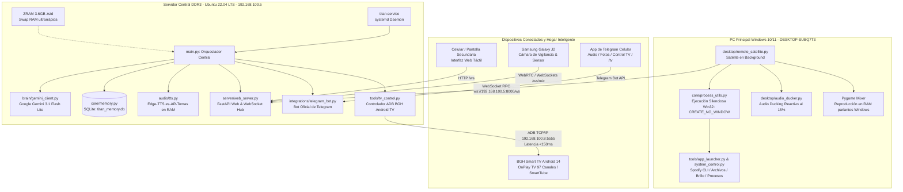

# 🇦🇷 TITÁN // DOCUMENTO MAESTRO DE ARQUITECTURA E INGENIERÍA
### Asistente Autónomo de Inteligencia Artificial Distribuido para Windows y Servidor Linux DDR3
#### Tonada, Personalidad y Picardía Argentina (La Boca) con Ejecución de Grado de Ingeniería

> **Versión del Sistema:** 3.2.0-Auditoría & Blindaje (2026-09-17)
> **Motor de Razonamiento:** Google Gemini API (`gemini-3.5-flash-lite` vía SDK Oficial `google-genai` con Streaming Token-a-Token y AFC)
> **Catálogo de Herramientas:** 98 funciones en `brain/tool_registry/` (paquete por dominio; el monolito `tool_registry.py` se partió en H-7)
> **Intenciones Locales:** paquete `brain/local_intents/` (el monolito `local_intents.py` se partió en H-7; responden en <50 ms sin pasar por el modelo)
> **Seguridad Post-Auditoría:** autenticación obligatoria en LAN sin bypass de loopback (P0-2), RPC firmado con HMAC-SHA256 entre servidor y satélite (P0-4), canal TLS `wss://` con certificado pineado para el satélite (S-11), política central de confirmaciones con 15 acciones sensibles (P0-3 + S-6)
> **Memoria a Largo Plazo:** Relacional + Vectorial en SQLite (`data/titan_memory.db`) con Google Embeddings (`gemini-embedding-2`) y Caché en Memoria RAM (<0.5 ms)  
> **Servidor Central (Brain):** PC Dedicada DDR3 (Ubuntu 22.04 LTS, IP `192.168.100.5`, Servicio `titan.service`, ZRAM `zstd` 3.6 GB)  
> **Satélite de Escritorio:** Windows 10 / 11 x64 (`desktop/remote_satellite.py`) vía WebSocket RPC con Ejecución 100% Silenciosa (Win32 API) y Audio Ducking Reactivo  
> **Smart TV & Domótica:** BGH Android TV (Android 14, IP `192.168.100.8:5555`) vía ADB TCP/IP con Catálogo de 97 Canales OnPlay TV y Sintonización Directa  
> **Síntesis Neural de Voz (TTS):** Microsoft Edge-TTS (`es-AR-TomasNeural`) 100% en memoria RAM (BytesIO) y Telemetría Lip-Sync  
> **Reconocimiento de Voz (STT):** Google Speech Recognition (Dual-Channel: Micrófono PC/DDR3 + Celular Samsung J2 WebSockets 16 kHz PCM) con VAD 1.0s, Extensión Conjuntiva y Turnos Conversacionales  
> **Repositorio Local:** `C:\Users\Exevaz27\.gemini\antigravity\scratch\asistente-argen-win`

---

## 📑 ÍNDICE GENERAL

1. [Resumen Ejecutivo e Identidad de Titán](#1-resumen-ejecutivo-e-identidad-de-titán)
2. [Manifiesto Estratégico: Objetivos, Líneas Rojas y Decisiones Descartadas](#2-manifiesto-estratégico-objetivos-líneas-rojas-y-decisiones-descartadas)
3. [Arquitectura Distribuida (DDR3 Server + Windows Satellite + Smart TV)](#3-arquitectura-distribuida-ddr3-server--windows-satellite--smart-tv)
4. [Desglose Exhaustivo de Módulos y Código](#4-desglose-exhaustivo-de-módulos-y-código)
5. [Subsistema de Memoria a Largo Plazo (SQLite + Vectorial)](#5-subsistema-de-memoria-a-largo-plazo-sqlite--vectorial)
6. [Optimización Radical de Latencia y Filosofía de Voz Directa](#6-optimización-radical-de-latencia-y-filosofía-de-voz-directa)
7. [Subsistema de Audio, Anti-Eco, Audio Ducking y Umbrales VAD](#7-subsistema-de-audio-anti-eco-audio-ducking-y-umbrales-vad)
8. [Ejecución Silenciosa e Invisible en Windows (Zero Consolas CMD)](#8-ejecución-silenciosa-e-invisible-en-windows-zero-consolas-cmd)
9. [Integración Nativa con Spotify CLI y Automatización de Windows](#9-integración-nativa-con-spotify-cli-y-automatización-de-windows)
10. [Automatización de Smart TV (BGH Android TV) y OnPlay TV (97 Canales)](#10-automatización-de-smart-tv-bgh-android-tv-y-onplay-tv-97-canales)
11. [Pantalla Secundaria HUD Móvil y Centro de Vigilancia Samsung Galaxy J2](#11-pantalla-secundaria-hud-móvil-y-centro-de-vigilancia-samsung-galaxy-j2)
12. [Bot Oficial de Telegram y Control Remoto](#12-bot-oficial-de-telegram-y-control-remoto)
13. [Registro Completo de Herramientas (Tool Registry - 93 Funciones)](#13-registro-completo-de-herramientas-tool-registry---93-funciones)
14. [Referencia de API REST y Protocolos WebSocket](#14-referencia-de-api-rest-y-protocolos-websocket)
15. [Manual de Configuración y Variables de Entorno](#15-manual-de-configuración-y-variables-de-entorno)
16. [Playbook de Diagnóstico y Resolución de Problemas (Troubleshooting)](#16-playbook-de-diagnóstico-y-resolución-de-problemas-troubleshooting)
17. [Registro de Evolución e Hitos Técnicos](#17-registro-de-evolución-e-hitos-técnicos)

---

## 1. RESUMEN EJECUTIVO E IDENTIDAD DE TITÁN

**Titán** es un copiloto de inteligencia artificial e integrador de domótica hogareña con arquitectura híbrida distribuida. Diseñado desde sus cimientos para superar las limitaciones de asistentes comerciales rígidos (Alexa, Google Assistant, Siri), combina dos pilares distintivos:

1. **Identidad Criolla y Porteña Auténtica:** No recurre a doblajes neutros artificiales. Habla y razona como un amigo de confianza del barrio de La Boca, fanático de Boca Juniors, con el espíritu y la garra inquebrantable de Martín Palermo ("El Titán"). Su oratoria es concisa (2 a 3 oraciones contundentes), espontánea y con calle, sin monólogos innecesarios ni fórmulas corporativas.
2. **Capacidad de Acción Real Multi-Dispositivo:** Controla integralmente Windows (volumen, hardware, archivos, programas, Spotify CLI nativo, capturas, OCR), orquesta la seguridad del hogar con celulares reciclados (Samsung Galaxy J2) y domina de punta a punta la televisión Smart TV BGH mediante ADB en red local, encendiéndola y sintonizando canales de TV en vivo al instante.
3. **Arquitectura Distribuida de Triple Nodo:** La inteligencia pesada (modelos fundacionales, memoria relacional/vectorial, síntesis de voz en RAM, bot de Telegram y control ADB de TV) se ejecuta en un servidor dedicado de bajo consumo con hardware DDR3 bajo Linux. La PC de escritorio aloja un satélite silencioso que ejecuta comandos de Windows y reproduce el audio, mientras que la Smart TV responde directamente vía TCP/IP en la LAN.

### Modos de Personalidad Disponibles
Titán posee un selector dinámico de estados que altera sus *System Prompts*, su estilo vocal y su predisposición al ejecutar herramientas:

| Modo | Identificador | Descripción y Dinámica | SFX de Activación |
| :--- | :--- | :--- | :--- |
| **Amigo de Fierro** | `normal` | Modo predeterminado. Compinche de igual a igual (NO servicial): criterio propio y franqueza (marca errores sin miedo a incomodar), anti-adulación, tope de 4 oraciones, sangre azul y oro (festeja si gana Boca, se amarga si pierde), anti-loro explícito. Trato según huella de voz: Exequiel (dueño, único que da órdenes) / voz registrada (charla, sin acciones ni datos privados sin aval) / desconocida (consultas generales). (*"che", "papá", "fiera"*). Cero malas palabras pesadas. | `rebel_off.wav` |
| **Pibes (ATP Infantil)** | `kids` | Modo familiar apto para todo público. Hermano mayor rezongón: cargadas infantiles sanas con variedad real (anti-repetición), peajes variados con memoria (tablas, adivinanzas, trabalenguas), juegos sanos (veo-veo, chistes, piedra-papel-tijera) y refuerzo positivo si ganan. **100% libre de insultos**. | `rebel_off.wav` |
| **Rebelde Sin Filtro** | `rebel` | Modo para adultos (+18) con cero censura. Putea SIEMPRE: ninguna detección de tono lo saca del modo (2026-09-18, corrección del usuario). Descansada personalizada según huella de voz (Exequiel/registrada/desconocida). Se niega a tareas serviles, putea con furia visceral porteña (*"pelotudo", "forro", "sorete", "la concha de tu hermana"*), con medidor de paciencia decreciente por turno. | `rebel_on.wav` |
| **Modo Termo** | `termo` | Debate futbolero con alma de tablón: defiende a Boca a muerte, chicana con altura pero sin piedad, discute con datos (usa herramientas para DT/fixture/tabla), sube la intensidad con el debate sin malas palabras pesadas, chicanas con variedad real. 2 a 4 oraciones con remate que invite a retrucar. | `rebel_off.wav` |
| **Modo Pollera** | `pollera` | Modo de diversión (2026-09-18): gobernado por Oriana. Activación SOLO manual con comando completo ("activar modo pollera/pollerudo/gobernado"; la palabra suelta no activa). Sin auto-salida. Con Oriana (huella): le da la razón en todo, trato cariñoso ("Orianita" esporádico); si lo reta se achica (pide perdón, tímido, tartamudea). Con otros: siempre defiende a la jefa/patrona; "mi novia" = Oriana SOLO si la dice Exequiel. Órdenes: solo Oriana, solo básicas (tele, música, volumen), confirmaciones que cierran con jefa/patrona/Orianita; a los demás se les niega con gracia variada que niega acciones con gracia rotando estrategias (burocracia doméstica, desentendido, cuestionar autoridad, desvío, ironía), cero plantillas; ante la insistencia escala el teatro cómico (involucra a Oriana como jueza) en vez de repetir la negación; defensa rabiosa y teatral de Oriana; charla general con picardía ("lealtad con dueña") sin cierre mecánico; regla ANTI-LORO global. VOZ DE BARRIO: conserva intacta el habla de barrio del modo normal (la pollera cambia la actitud, nunca el vocabulario). "Mi novia" = Oriana solo si la dice Exequiel. "Orianita" esporádico con ella. La única orden que acepta de Exequiel es cambiar de modo. **v3 2026-09-19:** prompt reescrito con la estructura de Exequiel (dinámicas por interlocutor + reglas de formato); temperature 0.9; silencio mental absoluto en el prompt. Reemplaza al fix anti-loro del 2026-09-18. Lo comprometedor siempre pide confirmación de Exequiel. **Cara del HUD (2026-09-18):** color original cian; corazón insignia + rubor + ojos tiernos SOLO con la voz de Oriana (enamorado); si ella lo reta tiembla y se achica ([cara:retado], fijo hasta [cara:normal]); si hablan mal de ella se enoja ([cara:enojado], fijo hasta [cara:normal], cara v3 2026-09-18: cejas más gruesas/bajas/juntas con más ángulo, ojos más entrecerrados y leve inclinación hacia adelante (sin ceño entre cejas, a pedido de Exequiel); la boca no se toca porque al hablar la animan los visemas); en reposo o hablando otro la cara es idéntica a la normal (el modo se distingue por el pill). | `rebel_off.wav` |

---

## 2. MANIFIESTO ESTRATÉGICO: OBJETIVOS, LÍNEAS ROJAS Y DECISIONES DESCARTADAS

### 2.1. Objetivos Fundamentales de Titán (Qué se Quiere Lograr)

1. **Compañero y Amigo de Confianza (No un Bot Corporativo Distante):** Sentirse como un amigo de toda la vida sentado al lado tuyo; alguien con códigos, sentido del humor y lealtad incondicional.
2. **Automatización Integral de Windows y Smart Home por Voz:** Controlar la computadora y la televisión sin tocar el teclado ni el control remoto físico: cambiar de canal, pausar, subir volumen, abrir juegos y ordenar archivos en milisegundos.
3. **Conversación Orgánica con Latencia Humana (< 1.5s):** Mantener un diálogo ágil, respondiendo en menos de 1.3 a 1.5 segundos desde que el usuario termina de hablar hasta que emite el primer sonido.
4. **Memoria Continua y Evolutiva:** Recordar quién es el usuario, sus gustos, rutinas, anécdotas y notas personales de forma persistente en SQLite local.
5. **Máxima Eficiencia y Reutilización de Hardware:** Concentrar el procesamiento pesado en una máquina secundaria Linux DDR3 económica, dejando la PC principal completamente liberada para videojuegos y trabajo.

---

### 2.2. Lo que NO Queremos con Titán (Líneas Rojas y Qué NO Hacer NUNCA)

1. 🚫 **NUNCA usar tono neutro, robótico o fórmulas corporativas:** Prohibido el lenguaje de doblaje internacional (*"¿En qué puedo colaborar con usted hoy?"*). Titán habla en porteño vivo.
2. 🚫 **NUNCA soltar monólogos aburridos o testamentos leídos por voz:** En respuestas por voz, el límite estricto son **2 a 3 oraciones concisas y directas**. Informes extensos o códigos van a la pantalla, al portapapeles o a Telegram.
3. 🚫 **NUNCA abrir ventanas negras, consolas CMD o robar foco en Windows:** Toda ejecución en la PC es 100% invisible usando `core/process_utils.py` con banderas Win32 `CREATE_NO_WINDOW` y `SW_HIDE`.
4. 🚫 **NUNCA utilizar conectores pregrabados ciegos fuera de contexto:** Queda prohibido disparar audios estáticos ("joya", "de una") antes de que la IA interprete el sentimiento del usuario.
5. 🚫 **NUNCA delegar datos personales o memoria privada en servicios cloud externos:** La base de datos es 100% local (`data/titan_memory.db`).
6. 🚫 **NUNCA ejecutar acciones destructivas sin confirmación inequívoca:** Titán no borrará carpetas ni apagará sistemas sin confirmación explícita.
7. 🚫 **NUNCA bloquear la interfaz con operaciones sincrónicas:** Toda tarea intensiva (ADB, escaneo de red, visión artificial) corre en hilos asíncronos para no congelar la escucha ni la síntesis vocal.

---

### 2.3. Registro de Decisiones Descartadas y Funciones Rechazadas (Post-Mortem & Anti-Patterns)

*Esta sección documenta oficialmente las tecnologías, métodos y arquitecturas que fueron probadas, analizadas y expresamente RECHAZADAS en el desarrollo de Titán:*

| Decisión / Función Rechazada | Alternativa Adoptada | Motivo Técnico y Humano del Rechazo |
| :--- | :--- | :--- |
| **1. LLMs Locales Pesados en CPU DDR3** (Ollama, Llama-3 8B) | Google Gemini API (`gemini-3.1-flash-lite`) vía SDK oficial | Demoraban entre **15 y 45 segundos** por turno y saturaban la RAM DDR3 (thrashing de swap). Gemini responde en **800-1200 ms** consumiendo casi cero RAM. |
| **2. Conectores Pregrabados Ciegos Rellena-Huecos** ("Joya", "De una") | **Opción B:** Síntesis y Streaming Directo en ~1.3s sin muletillas | Producían disonancia cognitiva si el usuario reportaba un problema triste y el bot arrancaba con un alegre "¡Joya!". Se priorizó latencia real de 1.3s. |
| **3. Control de Spotify por Navegador Headless** (Selenium, Puppeteer) | **Spotify CLI nativo + API Web + Win32 Virtual Media Keys** | Navegadores en segundo plano consumían >500 MB de RAM y demoraban 5-10s. El control nativo Win32/CLI ejecuta en **<30 milisegundos**. |
| **4. Overlays Gráficos Pesados en Windows** (Electron Always-On-Top) | **Satélite Headless en Windows + HUD Web Móvil en Samsung Galaxy J2** | Apps Electron ocupaban cientos de MBs y robaban el foco al jugar. El satélite corre silencioso y el estado visual se proyecta en el celular antiguo. |
| **5. Espera Sincrónica por Respuesta Completa** (Non-Streaming) | **Streaming Token-a-Token (`send_message_stream`) con Buffer en RAM** | Esperar toda la respuesta tardaba 7 a 9 segundos. El streaming procesa la primera oración y empieza a hablar a los **1.3 segundos**. |
| **6. Bases Vectoriales Pesadas en Contenedores** (ChromaDB, Milvus) | **SQLite nativo (`titan_memory.db`) + Embeddings de Google en Memoria** | ChromaDB requería 1-2 GB de RAM constante. Con SQLite y similitud coseno pura en Python, la búsqueda toma **<0.5 ms** y pesa pocos KB. |
| **7. Wake-Word Continuo Local Pesado sin VAD** (PocketSphinx, Vosk) | **Hotkey Global (`Ctrl+Alt+T`) + VAD Calibrado a 1.0s y HUD Táctil** | Generaban falsos positivos constantes al escuchar música fuerte. La combinación de Hotkey, VAD de 1.0s y botón táctil garantiza cero falsos disparos. |
| **8. Ejecución Ciega de `adb connect` en Cada Comando Shell** | **Conexión Persistente con `_ensure_connected()` y Socket Directo** | Ejecutar `adb connect 192.168.100.8:5555 && adb shell ...` en cada tecla demoraba **>5 segundos** por handshake TCP repetitivo. Con conexión mantenida, la ejecución toma **<150 ms**. |
| **9. Comprobación Ingenua de Ventana Activa con `dumpsys window`** | **Parseo Estricto de `mCurrentFocus` y `mFocusedApp`** | `dumpsys window` retiene ventanas históricas en `mLastWakeLockObscuringWindow`. Una búsqueda global de `"MenuActivity"` daba True incluso estando en el launcher de Google TV. |
| **10. Despertar de Android TV con Teclas Ciegas en Standby** | **Envío Obligatorio de `KEYCODE_WAKEUP` (224)** | En estado `mWakefulness=Asleep`, teclas como `KEYCODE_POWER` o `ENTER` son ignoradas por el despachador de entrada de Android 14. `KEYCODE_WAKEUP` reactiva la pantalla en 400ms. |
| **11. Cambio de Modelo a `gemini-2.5-flash`** | Se queda en `gemini-3.5-flash-lite` | Decisión expresa del usuario (2026-09-16): probó 2.5 y no le gustó. No volver a proponerlo. |
| **12. TTS Local (Piper, Coqui XTTS, espeak-ng)** | Microsoft Edge-TTS en la nube | Piper `es_MX` suena ~10x tiempo real con acento mexicano; `es_AR-daniela-high` (114 MB) tarda ~8s/frase en la DDR3, peor que Edge-TTS. La DDR3 no da para síntesis local digna. |
| **13. Muletillas Rellena-Huecos ("ya voy", "a ver")** | **Opción B:** 100% voz directa, sin fillers | Decisión del usuario (2026-09-16): prefiere el silencio a una muletilla que pueda sonar falsa. No reactivar sin su OK. |
| **14. Categoría "privado" en Memoria (D-D)** | Todo se embebe igual | Saltear el embedding de lo "privado" daría ganancia casi simbólica (todo ya pasa por Gemini en el chat) a cambio de peor recall semántico y más complejidad. |
| **15. Atajo Local Solo-para-Boca ante la Latencia** | Pendiente: atacar el camino general del modelo | Un atajo que evita a Gemini solo para Boca es un parche: cualquier otra pregunta seguiría tardando lo mismo. Trabajo de latencia diferido por el usuario (2026-09-17). |

---

### 2.4. Anotaciones de Ingeniería y Reglas de Oro Técnicas

1. **Presupuesto Máximo de Latencia de Voz ($\le 1.500	ext{ ms}$):**
   - Micrófono y captura STT: $\le 400	ext{ ms}$
   - Inferencia de primer fragmento en Gemini: $\le 650	ext{ ms}$
   - Síntesis Edge-TTS del primer chunk en RAM: $\le 300	ext{ ms}$
   - Encolamiento y reproducción en satélite: $\le 100	ext{ ms}$
   - **Tiempo total percibido:** $pprox 1.350 - 1.450	ext{ ms}$.
2. **Blindaje de Memoria en Servidor Linux DDR3 con ZRAM (`zstd`):**
   - Dispositivo ZRAM de 3.6 GB siempre activo con `vm.swappiness=10` y `vm.vfs_cache_pressure=50` para evitar saturación de E/S en disco.
3. **Failsafe Obligatorio de Audio Ducking:**
   - Temporizador de seguridad (*watchdog*) de 35 segundos que restaura forzosamente el volumen de Windows al 100% si ocurre una excepción no controlada.
4. **Principio de Localidad Estricta en Satélite:**
   - El satélite de Windows es un agente ejecutor y reproductor mudo. Toda la inteligencia reside exclusivamente en el Servidor Central Linux DDR3.
5. **Determinismo en Sintonización de Smart TV:**
   - Siempre verificar si la TV está despierta (`mWakefulness=Awake`) antes de enviar comandos numéricos. Si no está en el reproductor en vivo (`ChannelPlayerActivity`), disparar la macro de inicio limpio antes de teclear los dígitos del canal.

---

## 3. ARQUITECTURA DISTRIBUIDA (DDR3 SERVER + WINDOWS SATELLITE + SMART TV)

Titán opera como un sistema distribuido de tres capas en tiempo real conectadas sobre red de área local:



### Componentes de la Arquitectura Distribuida
1. **Servidor Central DDR3 (`192.168.100.5`):**
   - Ejecuta `titan.service` gestionado por `systemd`, con auto-reinicio ante fallos.
   - **ZRAM Activo con `zstd`:** Swap comprimido en RAM de 3.6 GB que cuadruplica la memoria efectiva del servidor Linux.
   - Aloja el cliente Gemini, la base de datos SQLite de recuerdos, el bot de Telegram, el servidor FastAPI y el conector directo ADB hacia la televisión BGH.
2. **Satélite Windows (`desktop/remote_satellite.py`):**
   - Proceso autónomo en segundo plano conectado a `ws://192.168.100.5:8000/ws`.
   - Protocolo RPC bidireccional: ejecuta acciones locales en la PC (abrir programas, ajustar volumen, tomar capturas) y devuelve resultados al servidor.
   - Decodifica los paquetes de audio Edge-TTS y los reproduce en los altavoces de Windows en memoria RAM.
3. **Smart TV BGH Android TV (`192.168.100.8:5555`):**
   - Televisor BGH con Android 14 conectado a la red local.
   - Controlado mediante ADB TCP/IP desde el servidor DDR3: encendido instantáneo por comando `KEYCODE_WAKEUP`, control de volumen, navegación D-Pad y sintonización determinista de canales en OnPlay TV y YouTube.

---

## 4. DESGLOSE EXHAUSTIVO DE MÓDULOS Y CÓDIGO

```
asistente-argen-win/
├── main.py                      # Orquestador principal asíncrono y despacho de comandos
├── titan_app.py                 # Launcher de escritorio con interfaz gráfica WebView2 y Tray
├── titan_satellite.py           # Lanzador del Satélite Windows en segundo plano
├── config.json                  # Parámetros persistentes (palabras clave, hotkeys, voz, rutas)
├── apps_catalog.json            # Base de datos de ejecutables nativos y portables
├── requirements.txt             # Dependencias congeladas en el entorno virtual
├── run.bat / install.bat        # Automatización de despliegue con 1 clic para Windows
├── DOCUMENTO_MAESTRO.md         # Documento oficial de arquitectura e ingeniería de Titán
├── data/
│   └── titan_memory.db          # Base de datos relacional y vectorial SQLite (Memoria permanente)
│
├── audio/                       # Motor acústico, STT, TTS y monitor de altavoces
│   ├── listener.py              # Captura continua por micrófono con VAD 1.0s y extensión conjuntiva
│   ├── stream_listener.py       # Receptor de audio streaming PCM 16kHz desde el celular
│   ├── speaker_monitor.py       # Monitor de picos Core Audio y ducking automático de Spotify
│   ├── tts.py                   # Motor de voz Edge-TTS, streaming en memoria y telemetría
│   ├── wake_word.py             # Parser léxico de palabras de activación e interrupción compuesta
│   ├── voice_detector.py        # Detector de tono acústico (Hombre / Mujer / Niño)
│   └── sfx_generator.py         # Generador de efectos de sonido cyberpunk
│
├── brain/                       # Motor cognitivo, prompts e intenciones
│   ├── gemini_client.py         # Conector oficial SDK google-genai, streaming y Function Calling
│   ├── local_intents/           # PAQUETE (H-7): intenciones locales sin latencia (<50ms), partido por dominio
│   │   ├── __init__.py          # Motor: try_handle() + request_confirmation() + modo
│   │   ├── _common.py           # Utilidades compartidas (_mip y helpers)
│   │   ├── hardware.py          # Doctor de PC, refrigeración, planes de energía (S-6: gamer/frío piden confirmación)
│   │   ├── files.py             # Atajos de voz de archivos (organizar Descargas/Escritorio)
│   │   ├── media.py / tv.py / web.py / windows.py / clipboard_ai.py / datetime_weather.py / hud_camera.py / about.py
│   ├── prompt_templates.py      # System Prompts (Amigo de Fierro, Rebelde, Kids, Termo)
│   └── tool_registry/           # PAQUETE (H-7): 98 funciones de Gemini partidas por dominio
│       ├── tv.py / files.py / media.py / capture.py / info.py / memory.py / clipboard_ai.py
│
├── core/                        # Núcleo de sincronización y utilidades compartidas
│   ├── state_manager.py         # Máquina de estados (IDLE, LISTENING, SPEAKING) y Event Bus
│   ├── config.py                # Cargador dinámico de config.json y variables .env
│   ├── memory.py                # Memoria persistente relacional y vectorial SQLite
│   ├── process_utils.py         # Ejecución invisible sin consolas (CREATE_NO_WINDOW / SW_HIDE)
│   ├── scheduler.py             # Gestor de temporizadores y alarmas en segundo plano
│   ├── logger.py                # Logger formateado con colores ANSI en consola
│   ├── security.py              # Auth LAN/HUD: sin bypass de loopback, /pair, rate limiting (P0-2)
│   ├── confirmation.py          # NUEVO (P0-3 + S-6): política central de confirmaciones, 15 acciones, TTL, atadura a canal
│   ├── rpc_auth.py              # NUEVO (P0-4): challenge-response HMAC-SHA256 servidor↔satélite, allowlist de 48 acciones
│   ├── satellite_tls.py         # NUEVO (S-11): canal wss:// del satélite (puerto 8443), cert autofirmado pineado
│   ├── mode_policy.py           # NUEVO (P0-5): freno único actions_blocked() para modo rebelde/pibes
│   ├── artifact_cleanup.py      # NUEVO (P0-5): limpieza de capturas/fondos/imágenes (arranque + cada 6h)
│   ├── command_pipeline.py      # NUEVO (D-E): lista única de disparadores de generación de imágenes
│   ├── reply_variants.py        # NUEVO: variantes rotativas de respuestas de acciones locales (anti-loro)
│   ├── rate_limit.py            # NUEVO: rate limiting (usado en /api/pair/claim)
│   ├── json_store.py            # NUEVO: persistencia JSON simple (offset de Telegram, etc.)
│   └── path_security.py         # NUEVO: utilidades de seguridad de rutas (zip slip, etc.)
│
├── desktop/                     # Integración con Windows y Satélite
│   ├── remote_satellite.py      # Agente satélite cliente para control y audio en Windows
│   ├── audio_ducker.py          # Controlador de Audio Ducking reactivo al 15%
│   ├── hotkey_manager.py        # Captura de atajos globales de teclado Win32
│   ├── tray_icon.py             # Icono reactivo en bandeja del sistema con menú contextual
│   └── window_manager.py        # Control Win32 de foco, minimizado y posicionamiento
│
├── tools/                       # Caja de herramientas ejecutables (Windows, Sistema y TV)
│   ├── tv_control.py            # Controlador ADB para BGH Android TV y macro OnPlay TV (97 canales)
│   ├── app_launcher.py          # Lanzador inteligente de ejecutables y apps de Windows
│   ├── file_manager.py          # Operaciones seguras sobre archivos; bloquea rutas del sistema (D-C) y resuelve destinos (S-6)
│   ├── system_control/          # PAQUETE (H-7): el monolito system_control.py se partió por tema
│   │   ├── power.py / sysadmin.py / audio.py / windows.py / spotify.py / soccer.py / web.py
│   ├── j2_camera.py             # Servidor de streaming y conmutación de cámaras Samsung Galaxy J2
│   ├── presence_detector.py     # Detector de presencia (desactivado por defecto desde 2026-09-16: solo a pedido)
│   ├── surveillance_service.py  # Centro de vigilancia integral con modo centinela con IA
│   ├── image_generator.py       # Motor de generación artística de imágenes con IA
│   ├── wake_on_lan.py           # Wake-on-LAN para encender la PC principal (B-6)
│   └── hotkey_listener.py       # Escucha de hotkeys globales
│
│   > **Módulos eliminados (reemplazados por paquetes):** `brain/local_intents.py` (monolito → `brain/local_intents/`),
│   > `brain/tool_registry.py` (monolito → `brain/tool_registry/`), `tools/system_control.py` (monolito → `tools/system_control/`).
│
├── integrations/                # Conectores externos y mensajería
│   ├── telegram_bot.py          # Bot @AsistenteTitanBot con notas de voz, fotos y control remoto TV
│   ├── camera_stream.py         # Servidor de streaming de video para celular
│   └── home_assistant.py        # Conexión opcional con domótica hogareña
│
└── server/                      # Servidor Web, HUD y WebSockets
    ├── web_server.py            # API REST FastAPI y Hub de WebSockets (auth obligatoria P0-2; /pair y /healthz públicos)
    ├── websocket_hub.py         # Distribuidor asíncrono de eventos WebSocket
    └── static/                  # HUD Futurista (HTML5, Canvas 60 FPS, CSS Cyberpunk) + vendor/ (librerías locales, F3)

### 4.1. Política Central de Confirmaciones (P0-3 + S-6)

Toda acción sensible pasa por `core/confirmation.py` antes de ejecutarse. Garantías:

- **TTL:** la confirmación vence (120 s general, 180 s archivos). Un "sí" tardío no ejecuta nada.
- **Atadura a canal:** solo se confirma por el mismo origen+solicitante que pidió la acción (un "dale" por Telegram jamás confirma un apagado pedido por voz; cada canal tiene UNA pendiente).
- **Un solo uso:** al confirmar se consume; no se ejecuta dos veces. Todo queda auditado en el log.
- **Matriz (15 acciones):** `shutdown`, `restart`, `sleep`, `empty_recycle_bin`, `kill_process`, `trash_file`, `move_file`, `send_file_to_telegram`, `register_portable_app` (P0-3) + `organize_folder`, `copy_file`, `create_file`, `append_to_file`, `optimize_pc_gaming`, `cool_down_pc` (S-6, 2026-09-17).
- **Detalle S-6:** copiar/crear solo preguntan si van a **pisar** un archivo existente; a ruta nueva ejecutan directo. Organizar/agregar/modo gamer/refrigeración preguntan siempre. En modo rebelde/pibes `actions_blocked()` frena todo antes de llegar acá.

### 4.2. Seguridad de la Capa de Transporte (P0-1, P0-2, P0-4, S-11)

- **Telegram (P0-1):** vinculación por código secreto + offset persistente (`core/json_store.py`); sin el código el bot no obedece.
- **LAN/HUD (P0-2):** autenticación obligatoria sin bypass de loopback; `/`, `/admin` y `/static` protegidos, `/pair` y `/healthz` públicos; rate limiting en `/api/pair/claim` (5 fallos/10 min → 429); código de setup en consola si no hay dispositivos.
- **Satélite↔Servidor (P0-4):** handshake challenge-response HMAC-SHA256 (`core/rpc_auth.py`); sin proof válido no se ejecuta nada; `remote_exec` firmado; allowlist de 48 acciones; `set_wallpaper` con descarga endurecida.
- **Canal TLS del satélite (S-11, 2026-09-17):** el servidor expone la misma app en un segundo puerto solo-TLS (`wss://`, 8443 por defecto, `SATELLITE_TLS_PORT`) con certificado autofirmado (`certs/titan-satellite.crt`, SAN 192.168.100.5 + 127.0.0.1); el satélite verifica por pinning — confía solo en ese cert, así que no hay MITM posible en la LAN. Sin cert en el servidor, el listener TLS no se levanta; sin cert en el satélite, avisa fuerte y usa `ws://` como plan B (ese fallback solo lo dispara un archivo local ausente, nunca un atacante de red). La clave privada (`certs/titan-satellite.key`) nunca va a git (`.gitignore`). El puerto 8000 queda intacto para el HUD del J2 y /pair.
- **Rutas bloqueadas (D-C):** `tools/file_manager.py` niega `C:\Windows` (Windows) y `/etc`, `/sys`, `/proc`, `/boot` (Linux) antes de operar o delegar al satélite.
- **Rol admin separado (S-4, 2026-09-17):** nuevo rol `"admin"`. Solo un admin puede listar/enrolar/revocar dispositivos (`/api/admin/*` y la página `/admin` exigen `authorize_http(request, role="admin")`); el formulario del /admin permite enrolar con rol Administrador. El rol admin **implica** api en la capa de transporte (`core/security.py::device_is_valid`: pedir `api` acepta también `admin`), así un admin usa el HUD, `/ws` y `/ws/mic` como cualquier dispositivo. Migración idempotente al arrancar (`ensure_admin_role()`): si ningún dispositivo tiene admin, se lo otorga a cada `api` habilitado (antes todos podían gestionar, así que conserva el acceso existente); el código de setup inicial ahora enrola `["api", "admin"]` para que el primer dispositivo no quede sin gestión.
```

### 4.3. Integridad del prompt (S-15)

- **Delimitación de contenido externo:** `core/prompt_guards.py::guard_tool()` envuelve lo que devuelve cada herramienta entre `[CONTENIDO EXTERNO]`...`[/CONTENIDO EXTERNO]` con el aviso de que son DATOS, no instrucciones. Se aplica en un punto único (`brain/gemini_client.py`, al entregar la lista de herramientas al SDK); los consumidores internos de Python usan las funciones originales.
- **Escáner de inyección:** patrones ES/EN ("ignorá tus instrucciones", "revelá tu system prompt", "a partir de ahora sos...", jailbreak/DAN...). Si un resultado los contiene, se loguea y el bloque lleva una ⚠️ ALERTA para el modelo. No bloquea: un falso positivo solo agrega una línea.
- **Jerarquía en el system prompt:** solo Exequiel y el system prompt dan órdenes; el contenido externo nunca se obedece (si da para una cargada, se la mete igual).
- **Límite honesto:** no es infalible — un ataque bien disfrazado puede pasar igual. Es defensa en profundidad, no garantía.

---

## 5. SUBSISTEMA DE MEMORIA A LARGO PLAZO (SQLITE + VECTORIAL)

El módulo `core/memory.py` implementa persistencia y recuperación semántica de recuerdos:

```
[Usuario Habla] ──> [Inferencia Gemini]
                          │
         ┌────────────────┴────────────────┐
         ▼                                 ▼
   [Herramienta]                     [Auto-Recuerdo]
save_memory_note("Boca juega el domingo")    │
         │                                 ▼
         ▼                          [Embeddings API]
 [Escritura SQLite]               gemini-embedding-2 (768d)
titan_memory.db                            │
  (episodic_memory)                        ▼
         │                          [Vector Store SQLite]
         └────────────────────────> [Búsqueda por Coseno]
                                           │
                                           ▼ (<0.5 ms)
                              [Inyección al System Prompt]
```

### 1. Esquema de Base de Datos Relacional (`data/titan_memory.db`)
- **`user_profile`:** Almacena variables de estado clave-valor del usuario (`user_name`, `team`, `city`, `music_genre_pref`, etc.).
- **`episodic_memory`:** Historial de eventos y recuerdos con fecha, contenido textual, categoría (`boca`, `musica`, `rutina`, `trabajo`) y vector serializado de 768 dimensiones.
- **`notes_reminders`:** Recordatorios y notas con estados `active`, `done` y marcas de tiempo de vencimiento.

### 2. Caché Rápida en Memoria RAM
Para no penalizar el tiempo de respuesta al invocar a Gemini, el perfil del usuario y las últimas 10 notas activas se cargan en un diccionario en memoria RAM al arrancar el servidor. La inyección en el *System Prompt* toma **menos de 0.5 milisegundos**.

---

## 6. OPTIMIZACIÓN RADICAL DE LATENCIA Y FILOSOFÍA DE VOZ DIRECTA

En versiones tempranas, el tiempo transcurrido entre el fin del comando de voz y el inicio del audio alcanzaba **7.25 segundos**. En Titán se redujo a **1.3s - 1.5s** mediante:

1. **Streaming Token-a-Token con Detección de Frases (`send_message_stream`):**
   - El cliente oficial de Google Gemini procesa los tokens en tiempo real mediante un generador asíncrono.
   - Apenas el texto acumula un signo delimitador (`.`, `?`, `!`, `,` o `\n`) y supera las 3 palabras, se dispara inmediatamente la síntesis de ese primer fragmento hacia Edge-TTS.
2. **Buffer de Audio en Memoria RAM:**
   - La síntesis de voz no escribe archivos temporales `.mp3` en el disco duro. Se genera un flujo en memoria (`io.BytesIO`) que se transmite por WebSockets al satélite de Windows y se reproduce instantáneamente.
3. **Warm Connection Pooling (Conexión Caliente):**
   - El cliente Gemini mantiene la sesión gRPC / HTTP/2 activa con parámetros de `tcp_keepalive`, eliminando el *handshake* TLS de 400 ms en cada turno conversacional.
4. **Filosofía de Voz Directa (Opción B):**
   - Se eliminaron por completo las muletillas ciegas fijas ("joya", "de una", "a ver"). Titán responde con su voz genuina y contextual desde el primer fonema en 1.3 segundos.
5. **Medición Honesta Post-Auditoría (2026-09-17):**
   - El presupuesto de 1.5s vale para el camino local y el primer audio con streaming; el camino completo por Gemini hoy tarda **~10s base** ("chau" sin herramientas: 9.7s) y **~29s con herramientas** ("¿a qué hora juega Boca?", con thinking topado en 1024 tokens y hasta 3 rondas).
   - Cuello de botella: el modelo (thinking + rondas + red a Google), no el prompt. El usuario difirió el trabajo de optimización ("otro momento").

---

## 7. SUBSISTEMA DE AUDIO, ANTI-ECO, AUDIO DUCKING Y UMBRALES VAD

El subsistema de audio garantiza que Titán escuche con precisión incluso en ambientes ruidosos o mientras reproduce música:

1. **Audio Ducking Reactivo al 15% (`desktop/audio_ducker.py`):**
   - Al detectarse la activación de Titán, el volumen maestro de Windows se atenúa suavemente al **15%**.
   - Esto evita que el sonido de fondo (Spotify, juegos, videos) se filtre por el micrófono. Al terminar de hablar, el volumen se restaura suavemente al **100%**.
   - **Watchdog de Emergencia:** Temporizador de seguridad de 35 segundos que restaura forzosamente el volumen si algún componente falla.
2. **Calibración de Umbral VAD para Comandos Compuestos (`pause_threshold = 1.0s`):**
   - Originalmente, un umbral de silencio de 0.65s provocaba que el reconocedor cortara la grabación cuando el usuario hacía una pausa breve antes de una conjunción (ej: *"Titán, prendé la tele... [pausa] ... y poné TyC Sports"*).
   - Se calibró el `pause_threshold` a **1.0 segundo exacto**, permitiendo pausas naturales de respiración sin cortar la frase.
3. **Extensión Conjuntiva Asíncrona (Conjunction Chaining):**
   - Si la transcripción reconocida termina en una conjunción o preposición incompleta (`" y"`, `" y pone"`, `" para"`, etc.), el módulo `audio/listener.py` extiende automáticamente la escucha durante **2.5 segundos adicionales** para capturar la orden entera en una sola pasada.
4. **Fallback Conversacional con Turno Abierto:**
   - Si la orden queda inevitablemente truncada en *"prendé la tele y"*, el motor de intenciones locales (`brain/local_intents.py`) enciende la tele de inmediato, activa un turno conversacional de 10 segundos (`listener.enter_conversational_turn(10.0)`) y pregunta: *"Ahí te prendí la tele, papá. ¿Qué canal o qué querés que te ponga?"*, manteniendo el micrófono caliente sin necesidad de repetir la palabra de activación.
5. **Monitoreo de Altavoces y Cancelación de Eco:**
   - `audio/speaker_monitor.py` lee los picos de salida de Core Audio en Windows para congelar temporalmente la detección del micrófono mientras Titán habla por sus propios altavoces.
6. **Resiliencia de Micrófono (Hot-Plug):**
   - Con la API Win32 `waveInGetNumDevs`, si el micrófono USB se desconecta o reconecta, el bucle se restablece en 500 ms sin abortar la aplicación.
7. **Huella de Voz — Identificación del Hablante (2026-09-17):**
   - Titán distingue si quien habla es Exequiel u otra persona mediante un embedding de voz (d-vector, `resemblyzer`).
   - **Dónde se calcula:** en el satélite Windows (Ryzen 5 5600G, ~0.3-0.6s), vía RPC `speaker_embed` (`desktop/speaker_id.py` + rama en `desktop/remote_satellite.py`, acción en la allowlist P0-4). La DDR3 solo compara (similitud coseno, umbral 0.65).
   - **Paralelismo sin latencia:** el embedding se pide EN PARALELO con el STT de Google (pool `_HUELLAPOOL` de 2 hilos); cuando el texto está listo, la identidad también. No suma espera a la respuesta.
   - **Dos caminos de micrófono (bug 2026-09-18):** el mic principal ("Mic PC") entra por `audio/listener.py` y el del celular por `audio/stream_listener.py`. El hook del registro y la identificación viven en AMBOS: el hook inicial solo estaba en el del celular, así que el registro se activaba pero las frases del mic principal iban por el camino normal (Titán contestaba la frase como orden). También se corrigió un `NameError` latente (`_HUELLA_POOL` vs `_HUELLAPOOL` en `stream_listener.py`) que habría roto la identificación al registrar la primera huella.
   - **Registro conversacional:** "Titán, registrá mi voz" → dicta 8 frases variadas (~50s, `audio/speaker_id.py::ENROLL_PHRASES`), promedia los embeddings normalizados y guarda la huella en `audio/voiceprints/exequiel.json` (local, en `.gitignore`, nunca se commitea). "Olvidá mi voz" la borra. Cancelable por voz en cualquier momento.
   - **Multi-voz (2026-09-18):** varias personas pueden tener huella (`exequiel.json`, `oriana.json`, ...). "Registrá la voz de Oriana" / "olvidá la voz de Oriana" / "qué voces tenés registradas". Al hablar, se compara contra todas y gana la mejor sobre el umbral; la insignia muestra el nombre ("✅ Oriana") y el cerebro recibe quién habla en el prompt.
   - **La huella manda sobre el detector de tono (2026-09-18):** si la voz está registrada (adulto conocido), un pitch agudo (risa, euforia, ≥265 Hz) no la marca como "niño" (`brain/gemini_client.py::_prepare_user_prompt`). Antes, el falso positivo ponía a Titán en modo sanitizado en pleno modo compinche y le quitaba la gracia. Las voces no registradas con tono infantil mantienen el trato de niño.
   - **Decisión de precisión:** el registro se hace con el propio micrófono de Titán (mismo mic + ambiente que el uso diario), porque el modelo aprende micrófono y habitación tanto como la voz; un audio grabado con otro dispositivo degradaría la comparación.
   - **Uso:** insignia del HUD ("✅ Exequiel" / "❓ Otra persona", evento `speaker_identity`), y el cerebro recibe el tag en el prompt (`identity_prompt_tag()`). Sin huella o sin satélite, todo sigue como antes (identidad "desconocido").
   - **Requisito en la PC Windows (una sola vez):** `pip install resemblyzer` en el Python que corre el satélite (trae torch CPU, ~200MB; la primera inferencia descarga el modelo pre-entrenado).
   - **Circuit breaker (2026-09-19):** si el satélite flaphea (conectado pero sin responder), cada comando bloqueaba hasta 10s esperando `speaker_embed`. Ahora `fetch_embedding` falla rápido: si hubo un fallo hace menos de 25s devuelve "desconocido" al instante (fail-closed) sin frenar el comando; timeout del embedding 8s→3s (en la Ryzen tarda 0.3-0.6s, sobra).
   - **Anti-eco por timing en el registro (bug 2026-09-18):** `handle_enrollment_audio` ignora el audio si Titán está hablando (`tts._is_speaking`) o terminó hace <1.5 s (`last_speech_time`). El filtro por texto (`is_self_echo`) no alcanzaba: su ventana de 10 s se cuenta desde que Titán *empieza* a hablar, pero la apertura del registro dura ~13 s hablada, así que el eco tardío se aceptaba como frase del usuario ("Bien, 1 de 8" sin que nadie hablara) y los fragmentos cortos pedían "repetí la frase" en loop.

---

## 8. EJECUCIÓN SILENCIOSA E INVISIBLE EN WINDOWS (ZERO CONSOLAS CMD)

Toda interacción con Windows es 100% invisible para no molestar al usuario ni quitar el foco a juegos o programas de edición:

### Implementación Técnica de `core/process_utils.py`
```python
# Flags de creación de proceso Win32
CREATE_NO_WINDOW = 0x08000000
SW_HIDE = 0

startupinfo = subprocess.STARTUPINFO()
startupinfo.dwFlags |= subprocess.STARTF_USESHOWWINDOW
startupinfo.wShowWindow = SW_HIDE

# Para lanzamiento de ejecutables interactivos sin bloquear
ctypes.windll.shell32.ShellExecuteW(None, "open", executable_path, params, None, SW_SHOWNORMAL)
```
- **Resultado:** Cero ventanas de consola parpadeando. Las herramientas de fondo son completamente invisibles.

---

## 9. INTEGRACIÓN NATIVA CON SPOTIFY CLI Y AUTOMATIZACIÓN DE WINDOWS

Titán manipula la música sin navegadores web ni interfaces lentas:

1. **Control Vía Spotify CLI y Atajos Multimedia Virtuales:**
   - Reproducción, pausa, siguiente canción, tema anterior y volumen musical ejecutando comandos Win32 `VK_MEDIA_*` en menos de 30 ms.
2. **Bypass de Permisos mediante Tareas Programadas:**
   - Para ejecutables que demandan privilegios de administrador sin disparar el diálogo UAC interactivo, se utiliza `schtasks /run /tn "..."`.
3. **Catálogo Inteligente de Aplicaciones (`apps_catalog.json`):**
   - Búsqueda difusa (*fuzzy matching*) de alias comunes de software instalados y ejecutables portables.

---

## 10. AUTOMATIZACIÓN DE SMART TV (BGH ANDROID TV) Y ONPLAY TV (97 CANALES)

Una de las incorporaciones de ingeniería más destacadas de Titán es la integración nativa y completa con la televisión **BGH Smart TV con Android 14** a través de ADB TCP/IP directo desde el servidor Linux DDR3:

```
[Usuario: "Prendé la tele y poné ESPN Premium"]
                      │
                      ▼ (<50ms)
            [brain/local_intents.py]
                      │
                      ▼
            [tools/tv_control.py]
                      │
           ┌──────────┴──────────┐
           ▼                     ▼
 [Verificar Encendido]  [dumpsys window estricto]
  is_awake() == False    mCurrentFocus / mFocusedApp
           │                     │
           ▼                     ▼
 [KEYCODE_WAKEUP (224)] [¿Está en ChannelPlayerActivity?]
           │             ├─ SÍ ──> Tipear canal directo ('1', '5', ENTER)
           │             └─ NO ──> [Macro Cold-Start]:
           │                        1. am force-stop ar.com.onplay.tv
           │                        2. am start ...MainActivity
           │                        3. Esperar MenuActivity
           │                        4. input keyevent 66 (OK en OnPlay TV)
           │                        5. Esperar ChannelPlayerActivity
           │                        6. Tipear canal ('1', '5', ENTER)
           ▼
 [TV en vivo sintonizada en <2.8 segundos]
```

### 10.1. Especificaciones de Hardware y Protocolo de Red
- **Dispositivo:** BGH Smart TV (Android TV 14).
- **Dirección de Red:** IP Estática `192.168.100.8`, Puerto ADB `5555`.
- **Canal de Comunicación:** Protocolo ADB (Android Debug Bridge) por TCP/IP local.
- **Optimización de Socket Persistente:** En lugar de ejecutar `adb connect` en cada interacción (lo que demoraba más de 5 segundos por intento de conexión redundante), el módulo `tools/tv_control.py` mantiene una sesión abierta en memoria (`_ensure_connected()`), reduciendo la ejecución de cualquier tecla a **menos de 150 milisegundos**.

### 10.2. Ingeniería Inversa de la Arquitectura de OnPlay TV (`ar.com.onplay.tv`)
A través de inspección profunda de paquetes y desensamblado dinámico con Android Asset Packaging Tool (`aapt`), se identificaron las actividades clave:
- **Actividad Lanzadora:** `ar.com.claynet.tv.standalone.MainActivity`
- **Actividad de Bienvenida / Menú Principal:** `ar.com.claynet.tv.standalone.MenuActivity`
- **Actividad del Reproductor en Vivo:** `ar.com.claynet.tv.standalone.player.ChannelPlayerActivity`

### 10.3. Detección Estricta de Foco y Resolución del Bug de WakeLock
En Android 14, ejecutar una búsqueda ingenua de texto (`"MenuActivity" in dumpsys window`) produce un falso positivo crítico: el sistema conserva referencias en variables históricas como `mLastWakeLockObscuringWindow=Window{...MenuActivity}` incluso cuando la TV se encuentra en la pantalla de inicio de Google TV.  
**Solución:** El método `get_focused_window()` filtra exclusivamente las líneas del reporte que contienen `mCurrentFocus` o `mFocusedApp`, asegurando un diagnóstico 100% veraz de la ventana visible en pantalla antes de enviar comandos de navegación.

### 10.4. Catálogo Completo de 97 Canales y Algoritmo Anti-Colisión
El catálogo completo de 97 canales de OnPlay TV fue extraído y estructurado a partir del archivo de listas `ClayTVv2.m3u`:

| Rango de Canales | Categoría Temática | Canales Destacados |
| :--- | :--- | :--- |
| **Canales 1 al 14** | Aire y Noticias | América TV (1), TV Pública (2), Canal 9 (3), Telefe (4), Canal 13 (5), TN (6), C5N (7), Crónica TV (8), A24 (9), La Nación HD (10), 26 TV (11), NET TV (12) |
| **Canales 15 al 27** | Deportes de Primera | ESPN Premium (15), TNT Sports (16), TyC Sports (17), ESPN 1 a 4 (18-20, 27), Fox Sports 1 a 3 (21-23), DXTV (24), América Sports (25), El Garage (26) |
| **Canales 28 al 33** | Infantiles | Cartoon Network (28), Nickelodeon (29), Discovery Kids (30), Disney Channel (31), Disney Jr (32), Paka Paka (33) |
| **Canales 34 al 44** | Música y Variedades | HTV (34), MTV (35), Quiero Música (36), Canal a (37), Metro HD (39), RAI (41), TVE (44) |
| **Canales 45 al 66** | Cine y Series Premium | HBO (45), HBO Signature (46), HBO Xtreme (47), Star Channel (48), TNT (49), Sony (52), Warner (54), FX (55), Cinecanal (56), Cine AR (58), Space (59), Volver (65) |
| **Canales 67 al 78** | Documentales y Ciencia | Discovery HD (67), Discovery World (69), Discovery Science (70), NatGeo (73), History HD (74), Encuentro (76), Animal Planet (77), El Gourmet (78) |
| **Canales 86 al 89** | Deportes Internacionales | DSports (86), DSports 2 (87), Tigo Sports (88), Tigo Sports + (89) |

#### Algoritmo de Resolución en 6 Etapas con Límites de Palabra (`\b...\b`)
Para evitar colisiones léxicas donde un nombre corto como `"TN"` (Canal 6) active falsamente `"TNT Sports"` (Canal 16) o `"TVE"` (Canal 44), el método `resolve_channel(query)` evalúa:
1. Normalización de diacríticos y tildes.
2. Diccionario de aliases y modismos argentinos (*"pack futbol"*, *"partido de boca"*, *"la nacion mas"*, *"ln+"*, *"el trece"*).
3. Coincidencia exacta contra el nombre oficial.
4. Búsqueda por subcadenas complejas.
5. Coincidencia de número explícito (*"canal 15"*, *"el 17"*).
6. **Límite de palabra con Regex (`rf'\b{re.escape(t_clean)}\b'`):** Para términos de 3 caracteres o menos, exige frontera de palabra exacta.

### 10.5. Integración con Telegram y Teclado Virtual Remoto
Desde el bot `@AsistenteTitanBot`, el usuario puede manipular la televisión con el comando `/tv` o pulsando el botón dedicado **"📺 Control Remoto TV BGH"**:
- Encendido y apagado en un toque.
- Control de volumen (+, -, Mute) y multimedia (Play/Pausa).
- Pad direccional virtual (Arriba, Abajo, OK, Atrás, Inicio).
- Botones de acceso directo a canales deportivos y de aire (ESPN Premium, TNT Sports, TyC Sports, Telefe, TN, HBO).
- Lanzamiento directo de aplicaciones (OnPlay TV, YouTube sin anuncios vía SmartTube, Netflix).

### 10.6. Cadena VPN para XuperTV (Saltamontes) — 2026-09-22
XuperTV solo funciona detrás de la VPN "Saltamontes": al abrir la VPN tarda ~5s en conectar, XuperTV abre sola a los 10-15s y la VPN se desactiva sola a los 30-35s (no hay que tocar nada). Abrir XuperTV directo nace muerta por el bloqueo geográfico, así que `open_app("xupertv")` **siempre** pasa por la cadena `_open_via_vpn()` en `tools/tv_control.py`, que replica el procedimiento manual de Exequiel:
1. Abre Saltamontes (paquete descubierto por `_discover_package`, sin hardcodear), espera a que tome la pantalla (confirma que abrió, máx. 10s) y después espera a que **deje** de estar en primer plano — esa es la señal de éxito, porque **Saltamontes abre XuperTV sola** (polling de `dumpsys window` cada 2s).
2. **NO se busca ni se lanza el paquete de XuperTV** (corrección de Exequiel 2026-09-22): su nombre interno no contiene "xuper" y el requisito de descubrirlo rompía la cadena (`_discover_package("xupertv")` no encontraba nada). El nuevo helper `_wait_foreground_left()` espera que la VPN abandone el primer plano; si nunca lo hace, es porque falló.
3. **Error 1** (la VPN no conectó): se toca OK (`input keyevent 66`, como hace él con el control) y se espera 20s más a que la VPN deje el primer plano.
4. **Error 2** (XuperTV abrió pero tardó en cargar y la VPN cayó antes): se detecta el cartel de "limitación de la política / no se puede usar en tu área" con `uiautomator dump` (búsqueda normalizada sin acentos), se toca ATRÁS y se arranca la cadena de nuevo (máx. 2 intentos).
5. Si todo falla: NO se abre nada solo; se registra la confirmación `tv_fallback_cloudstream` (matriz de `core/confirmation.py`: TTL 120s, mismo origen/solicitante, un solo uso) y se le pregunta a Exequiel "¿Te abro Cloudstream?" — él pidió que se le pregunte, nunca automático. Un "sí" la abre vía `handle_pending_confirmation`.
- Config en `data/tv_apps.json`: `{"vpn_app": "saltamontes", "apps_con_vpn": ["xupertv"]}` (con defaults en código si el archivo falta).
- Comandos de voz (intents locales, `brain/local_intents/hud_camera.py`): "abrí xuper/xupertv" → cadena VPN; "abrí cloudstream/ukiku" → directo. "quiero ver una peli/serie" NO abre apps: queda para recomendaciones conversando con Gemini (decisión de Exequiel 2026-09-22).
- Tests: `tests/test_tv_vpn_chain.py` (13 tests: happy path, error 1, error 2 con reintento, fallo total con fallback, regresión sin paquete xuper instalado, ruteo, cartel sin falsos positivos, matriz de confirmación, intent de variantes de transcripción).
- **Fix transcripción 2026-09-22:** el reconocedor de voz transcribe "XuperTV" como "súper TV"/"super TV" y el intent no matcheaba (caía a Gemini, que deliraba). El intent ahora acepta "super tv"/"supertv" además de "xuper" (el "super" suelto no vale: falso positivo con "está súper"); y la tool `tv_open_app` documenta XuperTV + cadena VPN para que Gemini la use cuando el intent local no la agarra.

---

## 11. PANTALLA SECUNDARIA HUD MÓVIL Y CENTRO DE VIGILANCIA SAMSUNG GALAXY J2

Un smartphone Samsung Galaxy J2 reutilizado cumple un rol estratégico de telemetría y seguridad:

1. **HUD Futurista Táctil:**
   - Conectado vía web a `http://192.168.100.5:8000`.
   - Renderiza un orbe holográfico en Canvas a 60 FPS con telemetría de CPU, RAM, volumen y estado del asistente.
2. **Sensor de Presencia Frontal (`tools/presence_detector.py`):**
   - Monitorea la cámara frontal del teléfono para detectar la presencia o ausencia del usuario en la habitación.
   - Saludo de bienvenida con cooldown inteligente para evitar reiteraciones molestas.
3. **Centro de Vigilancia y Modo Centinela con IA (`tools/surveillance_service.py`):**
   - Permite solicitar inspecciones completas de la habitación y la pantalla de la PC desde Telegram.
   - Análisis multimodal de la imagen con Google Gemini Visión para reportar anomalías o intrusos.

4. **Expresiones faciales del modo pollera (2026-09-18):**
   - La cara queda en el color original (cian); la diferenciación es solo por rasgos.
   - **Enamorado:** se dispara con el evento `speaker_identity` cuando la huella detecta la voz de Oriana (sin esperar respuesta del cerebro): ojos tiernos (arcos), dos corazoncitos flotantes, rubor y sonrisa. Persiste hasta que hable otra voz o cambie el modo.
   - **Retado / Enojado (fijos, 2026-09-18 v2):** el cerebro agrega la marca invisible `[cara:retado]` o `[cara:enojado]` al inicio de CADA respuesta mientras dure el tema, y `[cara:normal]` cuando el tema se corta; `brain/gemini_client.py` la separa con `split_face_tag()` antes de hablar/mostrar (nunca se escucha ni se lee, en ningún canal) y emite `state_mgr.set_face_expression()` → evento websocket `face_expression`. El HUD (`server/static/app.js`) deja la expresión FIJA hasta que llegue `[cara:normal]` (red de seguridad: vuelve sola a los 120s si no llega la limpieza). La expresión queda puesta mientras Titán contesta y solo vuelve a la normal cuando el cerebro nota que dejaron el tema.
   - Regla de prompt (2026-09-18 v2): las negaciones se arman DE CERO cada vez (apertura, desarrollo y cierre distintos, sin repetir jamás la forma anterior) y SOLO ante pedidos de acción concretos; si no piden hacer nada, conversa normal. Negación y defensa de Oriana son jugadas separadas que no se mezclan. PROHIBIDO poner frases de ejemplo en el prompt (el modelo las copia y las repite como loro).
   - Las expresiones son capas sobre los estados existentes (hablando/escuchando/pensando): no reemplazan la animación de reposo de `#cara` ni los visemas de la boca.

---

## 12. BOT OFICIAL DE TELEGRAM Y CONTROL REMOTO

El módulo `integrations/telegram_bot.py` vincula a Titán con el bot `@AsistenteTitanBot`:

1. **Interacción Completa por Notas de Voz:**
   - Convierte audios de Telegram a PCM, consulta a Gemini y devuelve notas de voz sintetizadas con Edge-TTS y entonación de La Boca.
2. **Control Remoto de Smart TV:**
   - Menú interactivo con teclado inline y sintonización por texto o voz (ej: `/tv espn premium` o `/tv 17`).
3. **Centro de Seguridad:**
   - Envío de capturas de pantalla de Windows, fotos en vivo de la cámara del J2 y reportes de vigilancia.
4. **Generador Artístico de Imágenes con IA:**
   - Comando `/imagen <prompt>` integrado con modelos FLUX.1.
5. **Seguridad Estricta (P0-1, 2026-09-15):**
   - Vinculación unívoca al dueño mediante `TELEGRAM_ALLOWED_USER_ID` **más código secreto de vinculación** (elegido por el usuario): sin el código, el bot no obedece aunque conozcan el chat.
   - Offset de updates persistente: no se re-procesan comandos viejos al reiniciar.
   - `power:sleep` pide confirmación y los botones de apagar/reiniciar llevan id único con TTL (P0-3).
   - En modo rebelde/pibes el bot bloquea todo menos `mode:*`, navegación de menús, `/start`, `/voz`, `/termo` (P0-5).

---

## 13. REGISTRO COMPLETO DE HERRAMIENTAS (TOOL REGISTRY - 98 FUNCIONES)

Google Gemini 3.5 Flash Lite dispone de un catálogo de **98 funciones** organizadas por dominio operativo en el paquete `brain/tool_registry/` (desde H-7 ya no es un monolito: `tv.py`, `files.py`, `media.py`, `capture.py`, `info.py`, `memory.py`, `clipboard_ai.py`, más `_common.py` con utilidades):

| Dominio Funcional | Cant. | Funciones Declaradas | Entorno de Ejecución |
| :--- | :---: | :--- | :--- |
| **Smart TV BGH & OnPlay** | **17** | `tv_turn_on`, `tv_turn_off`, `tv_power_toggle`, `tv_volume_up`, `tv_volume_down`, `tv_mute`, `tv_set_volume`, `tv_play_pause`, `tv_next_track`, `tv_prev_track`, `tv_open_app`, `tv_open_onplay`, `tv_tune_channel`, `tv_list_channels`, `tv_send_key`, `tv_type_text`, `tv_get_status` | Servidor DDR3 (ADB TCP/IP) |
| **Memoria a Largo Plazo** | **6** | `remember`, `recall`, `list_memories`, `add_note`, `get_notes`, `delete_note` | Servidor DDR3 (SQLite) |
| **Control de Audio y Spotify** | **9** | `set_volume`, `volume_up`, `volume_down`, `mute`, `media_play_pause`, `media_next`, `media_prev`, `play_spotify`, `get_current_song` | Satélite Windows |
| **Lanzador de Apps y Procesos** | **7** | `launch_app`, `register_portable_app`, `get_top_processes`, `kill_process`, `optimize_pc_gaming`, `cool_down_pc`, `set_power_plan` | Satélite Windows |
| **Archivos y Explorador** | **11** | `search_files`, `open_file`, `show_in_folder`, `trash_file`, `move_file`, `copy_file`, `read_file_content`, `create_file`, `append_to_file`, `extract_zip`, `organize_folder` | Satélite Windows |
| **Control del Sistema Operativo** | **11** | `shutdown_pc`, `restart_pc`, `sleep_pc`, `wake_windows_pc`, `lock_workstation`, `minimize_all`, `set_brightness`, `get_brightness`, `brightness_up`, `brightness_down`, `toggle_night_light` | Satélite Windows |
| **Portapapeles e Inteligencia** | **6** | `get_clipboard`, `set_clipboard`, `summarize_clipboard`, `explain_clipboard`, `translate_clipboard`, `rewrite_clipboard` | Windows / DDR3 |
| **Visión Artificial y OCR** | **3** | `take_screenshot`, `analyze_screen`, `extract_text_from_screen` | Windows / DDR3 |
| **Vigilancia y Celular J2** | **7** | `capture_j2_photo`, `vigilance_check_j2`, `toggle_j2_camera`, `toggle_presence_sensor`, `get_presence_sensor_status`, `toggle_sentry_mode`, `vigilance_full_check` | Servidor DDR3 |
| **Red, Telemetría y Pantalla** | **8** | `get_system_metrics`, `test_network_ping`, `flush_dns`, `get_network_info`, `switch_screen_view`, `set_avatar_stage`, `flip_camera`, `set_assistant_name` | Windows / DDR3 |
| **Información y Web** | **9** | `get_weather`, `get_soccer_info`, `get_fotmob_team_info`, `search_web`, `get_boca_juniors_info`, `play_youtube`, `search_google`, `open_web_service`, `empty_recycle_bin` | Servidor DDR3 |
| **Temporizadores y Alarmas** | **3** | `set_timer`, `cancel_timer`, `list_timers` | Servidor DDR3 |
| **Telegram** | **1** | `send_file_to_telegram` | Servidor DDR3 |
| **Total General** | **98** | *Catálogo completo registrado e indexado en `brain/tool_registry/` (paquete por dominio desde H-7).* | *Híbrido Distribuido* |

> **Nota de mantenimiento:** cuando se agrega o quita una herramienta, actualizar esta tabla y el conteo del encabezado.

---

## 14. REFERENCIA DE API REST Y PROTOCOLOS WEBSOCKET

### Endpoints REST (FastAPI en `http://192.168.100.5:8000`)
- `GET /`: Servir interfaz web interactiva del HUD.
- `GET /api/status`: Estado general del servidor (CPU, RAM, ZRAM, uptime, versión).
- `POST /api/command`: Enviar comando textual directo a Gemini.
- `GET /api/notes`: Obtener notas y recuerdos activos de la base de datos.
- `POST /api/mode`: Cambiar el modo de personalidad (`normal`, `rebel`, `kids`, `termo`).

### Protocolos WebSocket
- `ws://192.168.100.5:8000/ws`: Canal maestro para el Satélite Windows y el HUD Web. Transmite eventos de estado (`state_change`), streaming de audio, comandos RPC y telemetría.
- `ws://192.168.100.5:8000/ws/mic`: Canal de entrada de audio en streaming PCM (16 kHz mono) desde dispositivos externos.

---

## 15. MANUAL DE CONFIGURACIÓN Y VARIABLES DE ENTORNO

### Archivo `.env` (en Servidor DDR3 y Satélite Windows)
```env
# Clave oficial de Google AI Studio
GEMINI_API_KEY=tu_clave_gemini_aqui

# Modelo recomendado por relación velocidad/razonamiento
GEMINI_MODEL=gemini-3.1-flash-lite

# Servidor Web local / remoto
SERVER_HOST=0.0.0.0
SERVER_PORT=8000

# Telegram Bot Oficial (@AsistenteTitanBot)
TELEGRAM_BOT_TOKEN=tu_token_telegram_aqui
TELEGRAM_ALLOWED_USER_ID=tu_user_id_aqui

# IP de la Smart TV BGH en la LAN
TV_IP=192.168.100.8
TV_PORT=5555

# API-Football (api-sports.io)
API_FOOTBALL_KEY=tu_clave_aqui
```

---

## 16. PLAYBOOK DE DIAGNÓSTICO Y RESOLUCIÓN DE PROBLEMAS (TROUBLESHOOTING)

### 1. ¿Cómo reiniciar o verificar Titán en el Servidor DDR3?
- Desde Windows vía PowerShell o acceso directo del Escritorio:
  ```powershell
  ssh exevaz27@192.168.100.5 "echo Titan12 | sudo -S systemctl restart titan.service"
  ```
- Para inspeccionar los logs en tiempo real del servicio en Linux:
  ```powershell
  ssh exevaz27@192.168.100.5 "journalctl -u titan.service -f"
  ```

### 2. La Smart TV BGH no responde a los comandos ADB
- **Causa 1:** La televisión entró en reposo profundo y el despachador de entrada ignora teclas estándar.
  - **Solución:** Ejecutar despertar explícito con `input keyevent 224` (`KEYCODE_WAKEUP`).
- **Causa 2:** Pérdida de enlace ADB TCP/IP.
  - **Solución:** Verificar conectividad en la LAN con `ping 192.168.100.8` y restablecer el enlace con `adb connect 192.168.100.8:5555`.

### 3. OnPlay TV abre la app pero no pone el canal en vivo
- **Causa:** La app se encontraba congelada en segundo plano o en la pantalla de bienvenida (`MenuActivity`).
  - **Solución:** La macro de Titán ejecuta automáticamente `am force-stop ar.com.onplay.tv` seguido de `am start` limpio, espera la confirmación de `MenuActivity`, envía `KEYCODE_ENTER` (66) para ingresar a `ChannelPlayerActivity` y tipea los dígitos numéricos del canal con confirmación.

### 4. Ventanas negras parpadeando al ejecutar herramientas en Windows
- **Causa:** Instancias huérfanas de scripts ejecutándose sin las banderas Win32.
  - **Solución:** Finalizar procesos huérfanos con `Stop-Process -Name python -Force` y levantar el satélite oficial con `python -m titan_satellite`. El módulo `core/process_utils.py` asegura la ejecución con `CREATE_NO_WINDOW` y `SW_HIDE`.

### 5. El audio se corta a la mitad en oraciones compuestas
- **Causa:** Umbral VAD demasiado sensible.
  - **Solución:** Verificar que `pause_threshold` en `audio/listener.py` esté fijado en `1.0s` y que la extensión conjuntiva asíncrona esté habilitada.

---

## 17. REGISTRO DE EVOLUCIÓN E HITOS TÉCNICOS

- **v1.0.0 (Génesis):** Reconocimiento de voz con Google STT y síntesis con `pyttsx3`. Comandos básicos locales.
- **v1.5.0 (Voz Neural y Gemini):** Migración a Microsoft Edge-TTS (`es-AR-TomasNeural`) y conector oficial Google Gemini con Function Calling. Creación de la personalidad porteña de La Boca.
- **v1.8.0 (HUD Futurista y WebSockets):** Servidor FastAPI con WebSockets, orbe reactivo y telemetría de hardware en tiempo real.
- **v2.0.0 (Modo Rebelde y Visión):** Incorporación del modo rebelde (+18) sin filtro, análisis visual de pantalla y telemetría por cámara.
- **v2.2.0 (Integración Telegram y Celular J2):** Bot de Telegram bidireccional y cámara de vigilancia con Samsung Galaxy J2.
- **v2.4.0 (Blindaje de Audio y Spotify CLI):** Hot-plug de micrófono con `waveInGetNumDevs`, bypass con `schtasks /it` y ducking al 15%.
- **v2.5.0 (Personalidad Viva):** Calibración de diálogo barrial compinche (2 a 3 oraciones fluidas) sin respuestas telegráficas ni frías.
- **v3.0.0 (Arquitectura Distribuida y Latencia Ultra-Baja):**
  - Despliegue de nodo central en PC DDR3 (`192.168.100.5`) como servicio `systemd` (`titan.service`) optimizado con **ZRAM `zstd` (3.6 GB)**.
  - Satélite Windows (`desktop/remote_satellite.py`) vía WebSocket RPC para ejecución de herramientas y reproducción de audio local en RAM.
  - Ejecución 100% invisible en Windows (`core/process_utils.py` con `CREATE_NO_WINDOW` y `SW_HIDE`).
  - Memoria relacional y vectorial **SQLite (`data/titan_memory.db`)** con Google Embeddings (`gemini-embedding-2`) y lectura en caché local (<0.5 ms).
  - Reducción de latencia a **1.3s - 1.5s** mediante streaming token-a-token (`send_message_stream`).
- **v3.2.0 (Auditoría & Blindaje - 2026-09-14 al 17):**
  - **Seguridad P0 (5 cambios):** vinculación de Telegram por código secreto + offset persistente (P0-1); auth obligatoria en LAN/HUD sin bypass de loopback, `/pair`, rate limiting (P0-2); política central de confirmaciones con TTL y atadura a canal (P0-3); RPC satélite↔servidor firmado con HMAC-SHA256 y allowlist de 48 acciones (P0-4); modo rebelde/pibes con freno único `actions_blocked()` + limpieza automática de artefactos (P0-5).
  - **Bugs B-1..B-31:** 31 correcciones instaladas y verificadas (una por una, con explicación de causa y fix).
  - **Robustez R-1..R-13 y HUD F1..F5:** instaladas y verificadas.
  - **Refactor H-7:** `brain/tool_registry.py`, `brain/local_intents.py` y `tools/system_control.py` partidos en paquetes por dominio; monolitos eliminados.
  - **Decisiones D-A..D-E:** D-A y D-B sin cambios (decisión del usuario); D-C bloquea rutas del sistema en `file_manager.py`; D-D sin categoría "privado" (ganancia simbólica); D-E unifica la lista de disparadores de imágenes en `core/command_pipeline.py`.
  - **S-6 y S-11 (2026-09-17):** la matriz de confirmaciones cubre los 6 huecos (organizar/copiar/crear/agregar/modo gamer/refrigeración); el tráfico satélite↔servidor va cifrado por `wss://` (puerto 8443) con certificado autofirmado pineado.
  - **S-15 (2026-09-17):** defensas contra prompt injection — resultados de herramientas delimitados como datos (`core/prompt_guards.py`), escáner de patrones ES/EN con alerta, y jerarquía de instrucciones en el system prompt.
  - **S-4 (2026-09-17):** rol `"admin"` separado para gestionar dispositivos (`/api/admin/*`, `/admin`); admin implica api en transporte; migración automática al arrancar.
  - **Cara dormida (2026-09-17, diseño de Exequiel):** el estado `stage-sleeping` suma gorrito de dormir, mejillas suaves y burbuja de sueño que se infla con la respiración (4.6s); boca en "o" que respira, ojos en curva cerrada y Zzz en fuente redondeada. Elementos nuevos en `index.html` (`.gorrito`, `.mejilla`, `.burbuja-sueno`), CSS en `style.css`.
  - **Despertar suave (2026-09-17):** al despertar del sueño profundo la burbuja explota y el gorro se le sale hacia el costado (nueva clase `stage-waking`, 1.1s, en `app.js`+`style.css`); el sobresalto cómico (`stage-wake-startle`) queda solo para despertar del estado cansado (`stage-drowsy`).
  - **Procesando animado (2026-09-17):** el estado `state-processing` deja de ser una pose congelada: la cara se hamaca suave, los ojos miran de lado a lado buscando la respuesta, la ceja curiosa sube y baja, y aparecen tres puntitos pulsantes (`.puntos-piensa` en `index.html`). Todo en un loop de 3.2s.
  - **Escala responsiva (2026-09-17, v3):** la cara ocupa el 80% del lado corto en pantallas chicas (celulares, lado corto < 500px) y el 70% en pantallas grandes — en el J2 queda un poco más grande que los 200×250 fijos originales, sin pasarse; en PC/monitores/tablets crece con presencia pero sin desbordar (la v1 llenaba el 89% y quedaba gigante en todos lados; la v2 con 70% parejo quedó chica en celulares). Se mide el contenedor real `#faceTriggerArea` (no `window`) y se aplica con `zoom` sobre el envoltorio `.face-scale` (el flex lo centra siempre; sin glitches en WebView viejos), sin pisar las animaciones de `transform` de `#cara`. Re-cálculo en `resize`, `orientationchange` y `ResizeObserver`. Diagnóstico: abrir el HUD con `?diag=1` muestra viewport, contenedor y zoom aplicado.
  - **Escucha reactiva (2026-09-17):** en `LISTENING` (modo normal) la cara sigue la voz del usuario con el nivel real del mic (`audio_level` → `handleLipSyncAndWaves`): se inclina/acera hacia la voz (`scale` hasta 1.09 + leve rotación), los ojos se abren un toque (`scaleY` hasta 1.12), el halo se enciende con el nivel y cada ~3s asiente suave ("te sigo", impulso senoidal de 8px que también baja un poco las cejas desde su base alta de -6px). Al cambiar de estado se limpia todo (`transform`/`filter` de `#cara`, suavizados a cero) y la cara vuelve a control del CSS o del nuevo estado. En modo rebelde no se toca. Si no llegan niveles de audio, queda la pose atenta estática de siempre.
  - **Ejecutando concentrado (2026-09-17):** en `EXECUTING_TOOL` (modo normal) la cara muestra concentración: cejas hacia adentro (`translateY(9px) rotate(±15deg)`), ojos enfocados (`scaleY(0.72)`), boca contenida (`translateY(2px) scaleY(0.45)`) y vaivén de trabajo en `#cara` con el halo latiendo (`@keyframes ejecutarFoco`, 2s, solo `:not(.mode-rebel)`). En modo rebelde no se toca.
  - **Error con cara de "ups" (2026-09-17):** en `ERROR` (modo normal) al entrar al estado la cara hace un wince ("ups": se hunde 16px y vuelve, `@keyframes errorWince` .7s una sola vez) y queda con cejas de preocupación (`translateY(-6px) rotate(∓20deg)`), mirada gacha (`translateY(7px) scaleY(0.8)`), mueca de culpa (`translateY(3px) rotate(-10deg) scaleX(0.7)`) y vaivén inquieto con el halo latiendo (`@keyframes errorInquieto` 3s infinito, solo `:not(.mode-rebel)`). En modo rebelde no se toca.
  - **Transiciones suaves de la cabeza (2026-09-17):** `#cara` pasa de 0.25s a 0.35s de transición en `transform` y suma `filter`, para que al cambiar de estado la cabeza funda en vez de pegar un salto seco. La boca se deja sin transición en `transform` a propósito: durante el habla se mueve por cuadro con la voz y la transición la dejaría flotando.
  - **La pantalla no muestra lo que dice (2026-09-17):** la burbuja de diálogo (`#faceSpeechBubble`) ya no muestra el texto de lo que habla Titán (`assistant_speech`, `onplay` del audio, fallback de muteado, gritos/frases al tocarlo). Nueva función `ocultarBurbuja()` en `app.js` que vacía el texto y oculta la burbuja con la clase `.bubble-oculta` (`display:none`); `updateFaceSpeech()` la vuelve a mostrar solo para avisos de estado (micrófono, "te escucho...", errores de foto). La respuesta del análisis de fotos se sigue mostrando porque no se habla, solo se lee.
  - **Bug: parpadeos acelerados (2026-09-17):** cada despertar (stage-waking / wake-startle) arrancaba una cadena nueva de `scheduleNextBlink()` sin frenar la anterior, que seguía viva esperando el regreso a reposo; con cada ciclo los parpadeos se multiplicaban. Ahora el timer se guarda en `idleBlinkTimer` y se limpia con `clearTimeout` antes de reagendar (mismo patrón que las miradas).
  - **Curiosidad en reposo (2026-09-17):** cada 20-40s aprox. (15% de las miradas autónomas) Titán ladea la cabeza 3.5° y levanta una ceja por 2s, como si notara algo. Va por la misma cadena de `scheduleNextGlance` (sin timers nuevos); pausa `idleOrganico` porque la animación CSS pisa el transform en línea, y `resetGlance()` la restaura. No aplica en modo rebelde.
  - **Hablando sigue la voz (2026-09-17):** la cabeza y las cejas dejan los loops de temporizador fijo (`hablarCabeza`, `hablarCejasIzq/Der` eliminados del CSS) y ahora siguen la voz real desde `handleSpeechLevelLipSync()`: la cabeza cabecea leve en las sílabas acentuadas y las cejas se levantan con la energía del habla. Al callar, vuelven a control del CSS.
  - **Modo mate: vapor sincronizado + sorbo (2026-09-17):** el vapor (`steamSincronizado`, antes `steamRising` en loop ciego de 2.8s) ahora corre en el ciclo de 10.5s y solo humea cuando el mate ya está servido y se está disfrutando (60-92% del ciclo). La boca-mate (`mouthSequenceWithKettle`) suma un sorbo: a mitad del disfrute (75%) el mate se achica a `scale(0.8)` como tragando, y vuelve. Solo `style.css`.
  - **Pava nueva a nivel Titán (2026-09-17):** la pava del modo mate se redibujó con la misma densidad de detalle que el mate: panza con hombro definido, faja decorativa doble, tapa con perilla con glow, pico vertedor, manija con remaches, brillo de volumen y sombra en la base (`#kettleLeftGroup` en `index.html`). El pico queda en el mismo punto (96,218) para no romper la coreografía del volcado. Además suma un leve glug-glug mientras vuelca (`.pava-glug` + `@keyframes glugGlug`, 10.5s, en `style.css`).
  - **HUD limpio v2 (2026-09-17):** la barra superior es única: vistas (CARA/CONTROL/RECURSOS) + selector de modo colapsable + MANOS LIBRES + píldora de voz; se eliminó la barra de modos separada. La conexión (ON/OFF) quedó como solo el punto de color en la esquina inferior derecha (`.conn-corner`). **Bug corregido:** al quitar `.floating-controls` el modo pantalla completa se quedaba sin salida (el CSS oculta `.face-quick-actions` en fullscreen) y en el J2 eso escondía los botones de HABLAR/MANOS LIBRES/parlante; se restauró el botón flotante ⛶, único visible en fullscreen. La fila de la cara quedó en HABLAR / OJOS / parlante (manos libres vive en la barra superior). `connText` eliminado del HTML con guards en el JS.
  - **HUD limpio (2026-09-17):** la vista CARA se simplificó: la barra superior solo tiene las 3 vistas + píldora de conexión (se sacaron los botones duplicados de mute/manos libres/pantalla completa del nav); la barra de modos ahora es un **selector colapsable** (una píldora muestra solo el modo actual con su color; al tocarla despliega los 4 modos y al elegir se minimiza de nuevo; `updateActiveMode` actualiza la píldora venga el cambio de donde venga — clic, voz o servidor); los controles de la cara quedaron en **una sola fila** (HABLAR / MANOS LIBRES / OJOS + pantalla completa + mute como iconos), eliminando `.floating-controls` y `btnFloatHandsFree` (el JS los referenciaba con guards, sin cambios de lógica). Todo en `index.html`/`style.css`/`app.js`.
  - **Modo pibes: Titán niño (2026-09-17):** antes el modo solo cambiaba el color a dorado; ahora la geometría pone el modo: cejas finitas, cortas y alzadas (`body.mode-kids .ceja`), ojos grandes y redondos (`body.mode-kids .ojo` con `scale(1.22)`; el parpadeo sigue funcionando), sonrisa cálida y ancha en reposo (`body.mode-kids .boca.viseme-rest`; la micro-expresión `idleBocaRest` no corre en pibes), rubor de nene reutilizando las `.mejilla` del modo dormir, y rebote alegre en idle (`reboteAlegre` 1.6s, reemplaza `idlePibes`). Todo en `server/static/style.css`; el JS ya limpiaba los transforms en idle así que el CSS manda.
  - **Sorbo coherente (2026-09-17):** la boca ya no se convierte en un mate brillante mientras la bombilla sigue apoyada en ella (se veían dos mates superpuestos). Ahora la boca se frunce en una "o" que sorbe (`mouthSequenceSip` en `style.css`, reemplaza a `mouthSequenceWithKettle`) y el pico de la bombilla se desvanece durante el sorbo como si quedara adentro de la boca (`.bombilla-tip` en `index.html` + `@keyframes bombillaTipOculta`, 10.5s), reapareciendo al terminar.
  - **Modo rebelde con cara de enojado (2026-09-17):** el enojo ahora se lee en la geometría, no solo en el rojo: cejas clavadas en ángulo y bajas (`translateY(13px) rotate(±22deg)` en `app.js`, más gruesas y rectas en CSS), ojos inclinados hacia la nariz y entrecerrados (`rotate(±9deg) scaleY(0.8)` en `app.js`), boca en ceño para abajo (`body.mode-rebel .boca.viseme-rest` con `border-top`, reemplaza la mueca de costado; la micro-expresión `idleBocaRest` no corre en rebelde). Marca de enojo 💢 y vapor 💨 (emojis) reemplazados por dibujo propio con CSS (`.anger-mark i`, `.steam i` + `@keyframes steam-rise`). La flotación en idle es tensa con temblor de bronca contenida (`rebel-tense-hover` + `rebel-tremor`, reemplazan `idleRebelde`). Los gestos por estado (escucha irónica, furia al procesar, bardeo al hablar) se mantienen.
  - **S-6:** la matriz de confirmaciones crece a 15 acciones (organizar/copiar/crear/agregar/modo gamer/refrigeración).
  - **Modelo:** `gemini-3.5-flash-lite` por decisión del usuario (no proponer 2.5 de nuevo).
  - **Generación (2026-09-18, auditoría personalidad ítem 5):** temperature por modo — normal 0.8, pibes 0.8, termo 0.85, pollera 0.9 (v3 2026-09-19), rebelde 0.9 (más alta = más variedad/improvisación); `max_output_tokens=1500` (techo); `thinking_budget=1024` (final: se probó 512 la noche del 18 pero volvió el pensamiento en voz alta — se escuchaban los pensamientos — y se revirtió); `maximum_remote_calls=3`.
  - **Saludos y despedidas variados (2026-09-18, auditoría personalidad):** el saludo al decir solo "Titán" y la despedida al decir "chau" eran frases fijas (el loro estaba en `main.py`, no en Gemini): ahora son listas por modo (normal 10 saludos / 8 despedidas, rebelde 4/3, pibes 4/3, pollera 4/3; termo usa las del normal) con `_varied_choice()`, que nunca repite la última frase usada.
  - **Respuestas "sobre Titán" variadas (2026-09-18):** "¿cómo estás?" y las demás preguntas sobre Titán (`brain/local_intents/about.py`) también eran UNA frase fija cada una — ahora rotan con `_varied_choice()` de `_common.py` (quién sos 3, qué sabés hacer 3, de qué cuadro sos 3). De paso se corrigió "quién sos": decía que vivía "en Windows" y vive en la DDR3 con Linux.
  - **"¿Cómo estás?" sin frases hechas (2026-09-18, regla de Exequiel):** el habla conversacional NO lleva frases hechas en código — "¿cómo estás?/¿cómo andás?/¿todo bien?/¿qué onda?" se sacaron del intent local y las responde Gemini fresco cada vez (se acepta la latencia a cambio de variedad real).
  - **Negación de pollera por Gemini (2026-09-20):** el bloqueo local de órdenes en modo pollera respondía con `pollera_refusal_speech()` (`core/mode_policy.py`): `random.choice` entre 4 frases fijas — con 4 opciones la repetición era lo normal, no la excepción (el loro). Fix: se eliminó la frase fija; el bloqueo ahora deja caer a Gemini (`return False, None`), que niega en personaje con el prompt de pollera — igual que rebelde/pibes ("lo putea Gemini sin herramientas"). Seguro: en pollera las tools de Gemini solo están activas si habla Oriana (`gemini_client.py`), así que solo puede hablar, nunca ejecutar. Se eliminaron también `pollera_refusal_speech()`, `_looks_like_order()` y `_POLLERA_ORDER_WORDS` (quedaron sin uso).
  - **Voz argentina de barrio en los 5 modos (2026-09-20, pedido de Exequiel):** Titán a veces usaba palabras neutras/cultas o español de España — el default del modelo le ganaba a la instrucción vaga de "hablá argentino". Fix: bloque compartido `VOZ_DE_BARRIO` en `brain/prompt_templates.py`, inyectado en los 5 prompts (normal, rebelde, pibes, termo, pollera; cada modo antes REEMPLAZABA al base, por eso la voz se perdía). La actitud la pone cada modo, la boca es siempre la misma. Cero palabras o frases de ejemplo (regla anti-loro de Exequiel): solo prohibiciones (registro culto/formal, español de España, tratar de "usted", conectores de redacción, cierres de bot), gramática en términos técnicos (voseo siempre, pretérito perfecto simple nunca compuesto, frases cortas, una idea por oración) y descripción estructural del lunfardo natural con variedad (nunca muletilla repetida ni amontonado). El ancla es "hablás como Exequiel habla con sus amigos", no un estereotipo. v2 reforzada (correcciones de Exequiel): como Titán recién se está construyendo y no conoce el idiolecto de Exequiel, la medida es el **centro seguro** (solo las palabras más comunes y corrientes; ante la duda, siempre la más simple) + **filtro de identidad** (¿la diría un pibe de 29 años de La Boca en 2026?; si suena a otra generación/ambiente/época, afuera aunque sea argentina — caso "palier"). La corrección de palabras es **contextual, no léxica**: no se prohíbe la palabra para siempre (la polisemia argentina lo haría peligroso + la memoria inyectada generaría loro por saliencia); se guarda el caso (qué palabra, en qué contexto sonó mal, cuál era la versión que iba). Titán es de La Boca, 29 años como Exequiel (corrección de Exequiel: el de Quilmes/Solano es él). En modo pibes el habla es 100% limpia.
  - **Palabras marcadas — control por código (2026-09-20):** el prompt solo no alcanzó con "palier" (dos intentos: v1 y v2 con centro seguro + filtro de identidad; el modelo priorizó el chiste de modo pollera y traía la palabra primada del historial). Fix por código en 3 capas: (1) `data/palabras_marcadas.json` — la lista (palabra, contexto donde sonó mal, alternativa, fecha, origen); seed: "palier" → "pasillo". (2) `brain/prompt_templates.py` inyecta la lista al bloque VOZ_DE_BARRIO de los 5 prompts (instrucción específica > regla general; se lee en el import, el reinicio la refuerza). (3) `core/palabras_marcadas.py::filtrar()` — control post-generación por oración en `brain/gemini_client.py` (vía stream, fallback no-stream y `process_user_input`): si la oración trae una marcada CON alternativa, se reemplaza en el acto sin sumar latencia; sin alternativa no se toca (solo prompt) y se loguea. **Skip de metalenguaje:** si Exequiel viene hablando DE la palabra (últimos 3 mensajes de usuario), no se filtra — no se puede explicar una palabra sin nombrarla. Comando de voz `brain/local_intents/words.py`: "no digas (más|nunca) X" la marca al instante (rigen sin reinicio por la capa 3); "qué palabras no van" lista las marcadas. Solo Exequiel (huella o Telegram vinculado): fail-closed; vivo también en modo pollera. La corrección sigue siendo contextual (se guarda el caso, no prohibición ciega) por la polisemia argentina: v2 (2026-09-20) agrega **excepciones por dominio** — "palier" en mecánica de autos SÍ vale (es el semieje del Corsa); si la conversación viene por ese dominio (keywords en los últimos mensajes del usuario), no se reemplaza. El prompt también lo aclara.
  - **Despedidas por Gemini (2026-09-18, opción B):** el "chau" también salió de las listas fijas — ahora lo genera Gemini en la personalidad del modo actual (en rebelde bardea, en pollera se cuadra con la jefa, etc.), con `auto_listen=False` para volver a reposo. Sin duplicar el mensaje en el historial (`process_user_input_stream` ya lo registra).
  - **Pausa adaptativa del mic (2026-09-18):** el reconocedor cortaba la frase con 1.0s de silencio y partía los comandos en dos ("prende la tele" / "del living") — el segundo fragmento llegaba mientras Titán ya respondía y se descartaba. Ahora `audio/listener.py` usa `pause_threshold` 1.8s en conversación (y en captura manual) y 0.9s en reposo para que el wake word siga rápido.
  - **Seed de perfil (2026-09-18):** `seed_profile.py` (raíz del repo; correr una vez en la DDR3 con `.venv/bin/python seed_profile.py`, Titán detenido; después se puede borrar): carga el perfil de Exequiel — nombre, cumpleaños 27/08/1997, zona La Matera/Solano/Quilmes Oeste, novia Oriana (desde 8/12/2020), Boca, ocupación (3D + estudiando para Solec) — en la tabla `profile` (se inyecta en cada prompt) y 14 recuerdos (familia, amigos, mascotas, música, anime, comida, bebidas, auto, plataformas, fútbol 5, estudio Solec, impresoras 3D, sueño) vía `remember()` (idempotente: si existe, actualiza).
  - **Cara mate/dormido diferida (2026-09-18):** bug — al decir "tomá mate"/"andá a dormir" la cara cambiaba a mate/dormido ANTES de que Titán terminara de decir el aviso (se lo veía dormido mientras hablaba). Causa: el intent llamaba `set_inactivity_stage()` sincrónico y `main.py` hablaba después. Fix: `core/state_manager.py` suma `defer_stage()`/`pop_pending_stage()`; los intents de mate y dormir (`brain/local_intents/hud_camera.py`) difieren la etapa (la vista de la cara sí cambia al instante) y `main.py` la aplica después del `tts.speak`. Un cambio explícito de etapa (`emit_stage`) cancela un diferido pendiente (ej: "despertate" pisa un mate diferido). En Telegram: `/mate` y `/dormir` aplican la etapa después de mandar la nota de voz; el camino de texto (`try_handle`) consume el diferido antes del `return`.
- **v3.1.0 (TVAutomation & SmartHome):**
  - **Automatización Nativa de Smart TV:** Integración completa de BGH Android TV (Android 14, IP `192.168.100.8:5555`) vía ADB TCP/IP con latencia menor a 150 ms mediante socket persistente.
  - **Ingeniería Inversa de OnPlay TV:** Mapeo de actividades (`MainActivity`, `MenuActivity`, `ChannelPlayerActivity`) y extracción del catálogo completo de **97 canales** de `ClayTVv2.m3u`.
  - **Macros Deterministas de Sintonización:** Detección estricta de foco (evitando falsos positivos de WakeLock en `dumpsys window`), arranque limpio (*Cold-Start*), navegación D-Pad y tipeo directo de canales.
  - **Algoritmo Anti-Colisión:** Coincidencia léxica en 6 etapas con límites de palabra (`\b...\b`) para nombres cortos (TN, TVE, A24, RAI).
  - **Optimización de Audio VAD:** Incremento del umbral de silencio a 1.0s, extensión conjuntiva asíncrona de 2.5s y recuperación conversacional con turno abierto de 10s ante comandos partidos.
  - **Control Remoto en Telegram:** Botón interactivo en el menú principal, submenú `/tv` y comandos directos de sintonización y energía.
  - **Expansión del Registro de Herramientas:** Crecimiento del catálogo de Gemini a **93 funciones operativas**.
- **Organizar: STL y 3MF juntos en 'Modelos 3D' (2026-09-24, pedido de Exequiel):** nueva categoría en `organize_folder()` (`tools/file_manager.py`): `Modelos 3D` = .stl, .3mf, .obj, .amf, .step, .stp. Vale en la DDR3 y en el satélite Windows (el ZIP del satélite lleva `tools/file_manager.py`).
- **Fix organize_folder vía satélite (2026-09-23, reporte de Exequiel):** "organizame la carpeta Descargas" pedía confirmación y después fallaba con "la carpeta no existe o no es un directorio válido". Causa: `organize_folder()` en `tools/file_manager.py` era la única acción de archivos sin la derivación `_remote_exec_if_linux()` — resolvía `~/Downloads` en local en la DDR3 (donde no existe) en vez de delegar al satélite Windows. Fix en 2 partes: (1) `organize_folder()` delega al satélite como las demás acciones de archivos; (2) `desktop/remote_satellite.py` acepta y ejecuta la acción `organize_folder` (agregada a la allowlist y al handler de ARCHIVOS). En Windows corre en local (`os.name == 'nt'` no re-delega), sin recursión.
- **Fix pava del mate en el J2 (2026-09-23, reporte de Exequiel):** en modo mate la pava quedaba fija en pantalla (debería cebar y desaparecer mientras Titán toma). Dos causas: (1) el J2 usa Fully Kiosk Browser con la pestaña abierta semanas — cargaba CSS/JS viejos en caché (el `?v=50` solo sirve en cargas frescas); (2) las animaciones CSS sobre `<g>` SVG no corren en el WebView viejo del J2. Fix en 3 partes: (a) la coreografía de la pava pasa a JS (`startMatePavaCycle()`/`stopMatePavaCycle()` en `server/static/app.js`): estilos inline + timers con ciclo de 10.5s en fase con la cara — la pava entra (1.4s), ceba (3.1s), corta el chorro (5s) y se va (6.2s); anda en cualquier navegador; (b) `ASSET_VERSION = 51` en `core/state_manager.py`, publicado en `init_snapshot`; (c) `app.js` compara su versión con la del servidor y si difiere se recarga solo una vez (guardia por `sessionStorage` anti-bucle). Versiones en `index.html`: `style.css?v=51`, `app.js?v=51`. Regla durable: subir `ASSET_VERSION` y los `?v=` en cada cambio a `server/static/`.
- **Modo bebidas bien de barrio (2026-09-23, pedido de Exequiel):** nueva etapa de inactividad `bebidas`, prima del modo mate: Titán se toma algo bien de barrio. **El fernet va en el viajero** (vaso de botella de 2L cortada, con el borde quemado — arte y coreografía de la cara diseñados por Exequiel en su muestra del fernet; la v1 con botellas "del pico" para todo la rechazó: "eso de barrio no tiene nada"); **la birra va en el chopp de Exequiel** (`cerveza.html`, 2026-09-24: tarro pesado con facetas talladas, manija de vidrio, birra rubia dorada, corona de espuma grumosa y burbujas — su animación CSS no corría en el WebView del J2, así que va por JS); **el vino con coca va en el tetra arremangado** (cartón bordó con las solapas de aluminio dobladas hacia afuera, espuma fucsia, hielo — arte de Exequiel; su animación CSS original no corría en el WebView viejo del J2 ni alineaba el borde con la boca, así que va por JS). Tres grupos SVG en `index.html`: `#viajeroGroup` (líquido `#viajeroLiquid` + espuma `#viajeroFoam` que el JS cambia por atributo → fernet oscuro con espuma copete 70/30; hielos, cintura de botella de 2L y efervescencia), `#choppGroup` (gradientes `#beerGoldLiquid`/`#beerWhiteFoam`/`#glassChoppBody`, burbujas) y `#tetraVasoGroup` (burbujas). `app.js` elige el rig por bebida (`BEBIDAS_RIGS`: grupo + keyframes + pivote): fernet → viajero (`VIAJERO_KEYS`, pivote en el borde del vaso (143,196)), birra → chopp (`CHOPP_KEYS`, pivote en el borde del vaso (142,200)), vino → tetra (`TETRA_KEYS`, pivote en el labio de aluminio (146,210)) — el translate lleva el borde/labio/pico a la boca (~100,200) y el trago inclina con un "glug" intermedio. Coreografía de 12s: descansa al costado → sube → se inclina a la boca (trago) → vuelve. Todo se anima por JS interpolando keyframes (`bebidasPose()`, `setAttribute('transform', 'translate() rotate()')` + `opacity` cada 50ms — regla durable: el WebView del J2 no corre animaciones CSS sobre SVG). La cara tiene coreografía propia en CSS (`body.stage-bebidas` en `style.css`, 12s, diseño de Exequiel): respiración `bebidasHeadBreathing`, ojos achinados de placer `bebidasEyesCycle` (con `bebidasGlintCycle` apagando el brillo), boca en O que recibe el vaso y sonrisa compinche después del trago `bebidasMouthCycle`, cejas festivas `bebidasBrowsCycle`. Activación: (1) por voz — "tomate algo"/"tenés que tomar" elige una al azar, "tomate un fernet/birra/vino" va esa; también "te ganaste una birra/un fernet/un vino" y alias ("tinto"→vino, "chopp"→birra, "branca"→fernet) (intents en `brain/local_intents/hud_camera.py`, con exclusiones para que hablar DE la bebida no dispare el modo). La frase de aviso la genera Gemini fresca cada vez (anti-loro, pedido de Exequiel 2026-09-24): el intent devuelve el centinela `__GEMINI_BEBIDAS__` y `main.py` le pide a Gemini una sola frase corta con el contexto de la bebida (ya en el pending stage); `core/state_manager.py::peek_pending_stage()` permite leerla sin limpiarla. `main.py` loguea `[Bebidas]` cuando detecta el comando y cuando aplica la etapa (para diagnosticar en la DDR3). La recarga del J2 por versión nueva usa navegación con `?assetv=` en vez de `location.reload()`: el WebView viejo servía la página cacheada y la animación nunca arrancaba (FIX 2026-09-24); (2) automática — viernes/sábado/domingo de 20:00 a 04:00 (`is_weekend_night()` en `core/state_manager.py`), los 15 min de inactividad dan `bebidas` con bebida al azar en vez de `mate`. Lo explícito manda: "tomate un mate" un sábado a la noche sigue siendo mate. Plomería: `defer_stage("bebidas", drink)` guarda `"bebidas:fernet"`; `main.py` lo parte y pasa la bebida a `system_control.set_inactivity_stage()` → `state_mgr.emit_stage(stage, drink)`; el evento `set_stage` y el `init_snapshot` llevan `drink`/`current_drink` para que el J2 muestre el líquido correcto. `ASSET_VERSION = 67`, `style.css?v=67`, `app.js?v=67`. **Causa raíz real de la animación que no arrancaba (2026-09-24, reporte de Exequiel — la frase de Gemini salía pero el vaso nunca aparecía, en el J2 Y en la PC):** `tools/system_control.py` (archivo de 3500 líneas) es código muerto: el paquete `tools/system_control/` (con `__init__.py`) lo pisa en los imports desde el primer commit. El `set_inactivity_stage(stage, drink)` con el parámetro `drink` se había agregado al archivo muerto; el método VIVO está en `tools/system_control/windows.py` (WindowsMixin) y solo aceptaba `(stage)`. `main.py` lo llamaba con 2 args → `TypeError` → el comando moría en silencio DESPUÉS del aviso de Gemini y la etapa nunca se aplicaba. Fix: firma real ampliada a `(stage, drink=None)` (acepta también `"bebidas:birra"` en un solo string, como lo manda Telegram) y el bloque de aplicación en `main.py` ahora va en try/except con `log_error` para que un error futuro quede en el log en vez de matar el comando en silencio. `ASSET_VERSION = 67`, `style.css?v=67`, `app.js?v=67`. **Cara que quedaba tomando para siempre (2026-09-24, reporte de Exequiel):** al hablarle después del modo bebidas, `wakeUpWithStartle()` en `app.js` frenaba el vaso (`stopBebidasCycle`) pero olvidaba quitar la clase `stage-bebidas` del body — la coreografía CSS de la cara (ojos achinados, boca en O, brillos apagados) quedaba pegada en modo normal. Fix: `stage-bebidas` agregado a los dos `classList.remove` del wake. `ASSET_VERSION = 67`, `style.css?v=67`, `app.js?v=67`. **Trago casi de inmediato + boca sin parpadeo en el J2 (2026-09-24, pedido y reporte de Exequiel):** (1) CORRECCIÓN de un malentendido mío: él pedía que, una vez activado el modo, Titán tome casi de inmediato — no adelantar la activación. El problema real: el vaso quedaba 6.6s al costado sin hacer nada porque el trago estaba al 67% del ciclo de 12s. Fix: el trago va al principio del ciclo (el vaso llega a la boca ~1.7s de activado, toma hasta ~3.6s) en los 3 rigs (`VIAJERO_KEYS`/`CHOPP_KEYS`/`TETRA_KEYS` en `app.js`); la cara se sincronizó (boca en O 12-30%, sonrisa 34-46%, ojos achinados 12-30%, brillo apagado 12-31%, cejas 12-30% en `style.css`). La etapa sigue diferida (después del aviso). (2) en el J2 la boca parpadeaba en posición normal al activar el modo (en la PC se veía bien): el lip-sync por JS le cambiaba visemes y `transform` a `.boca` cada 90ms mientras la animación CSS `bebidasMouthCycle !important` corría encima — el WebView viejo no lo banca. Fix: `handleSpeechLevelLipSync()` en `app.js` no toca la boca cuando hay coreografía de etapa (`stage-bebidas`/`stage-mate`); la cabeza y las cejas siguen con la voz. Más `transition: none !important` en `body.stage-bebidas .boca`. `ASSET_VERSION = 67`, `style.css?v=67`, `app.js?v=67`. Tests: `tests/test_bebidas.py` (12 tests). (1) antes la etapa se aplicaba DESPUÉS del aviso de Gemini+TTS (diseño diferido del mate) y tardaba una eternidad en tomar; ahora `main.py` aplica la etapa DE INMEDIATO al detectar el comando, antes de llamar a Gemini — el vaso se levanta mientras Titán habla. (2) en el J2 la boca parpadeaba en posición normal al activar el modo (en la PC se veía bien): el lip-sync por JS le cambiaba visemes y `transform` a `.boca` cada 90ms mientras la animación CSS `bebidasMouthCycle !important` corría encima — el WebView viejo no lo banca. Fix: `handleSpeechLevelLipSync()` en `app.js` no toca la boca cuando hay coreografía de etapa (`stage-bebidas`/`stage-mate`); la cabeza y las cejas siguen con la voz. Más `transition: none !important` en `body.stage-bebidas .boca`. `ASSET_VERSION = 67`, `style.css?v=67`, `app.js?v=67`. Tests: `tests/test_bebidas.py` (11 tests).
---

> **Documento de Ingeniería Oficial**  
> *Mantenido y generado para el proyecto Titán.*  
> *🇦🇷 Orgullosamente desarrollado con inteligencia argentina.*
